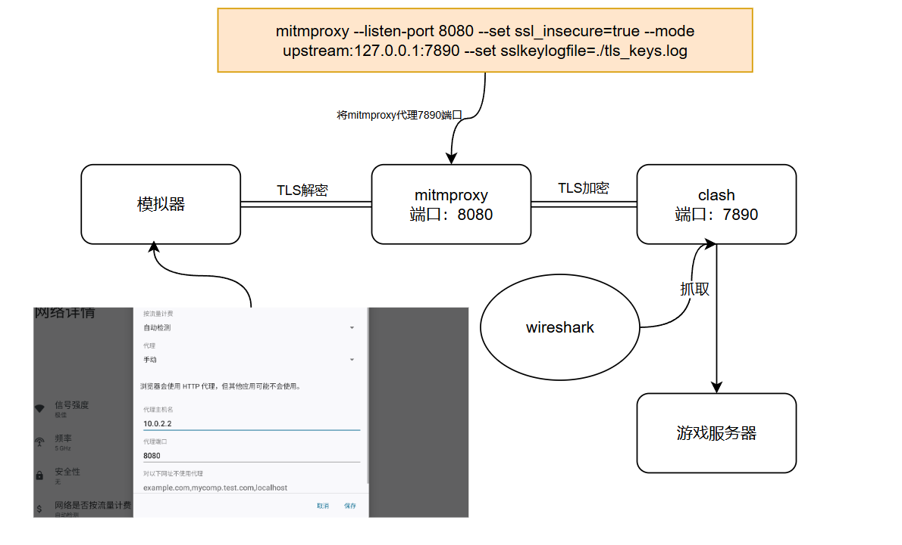
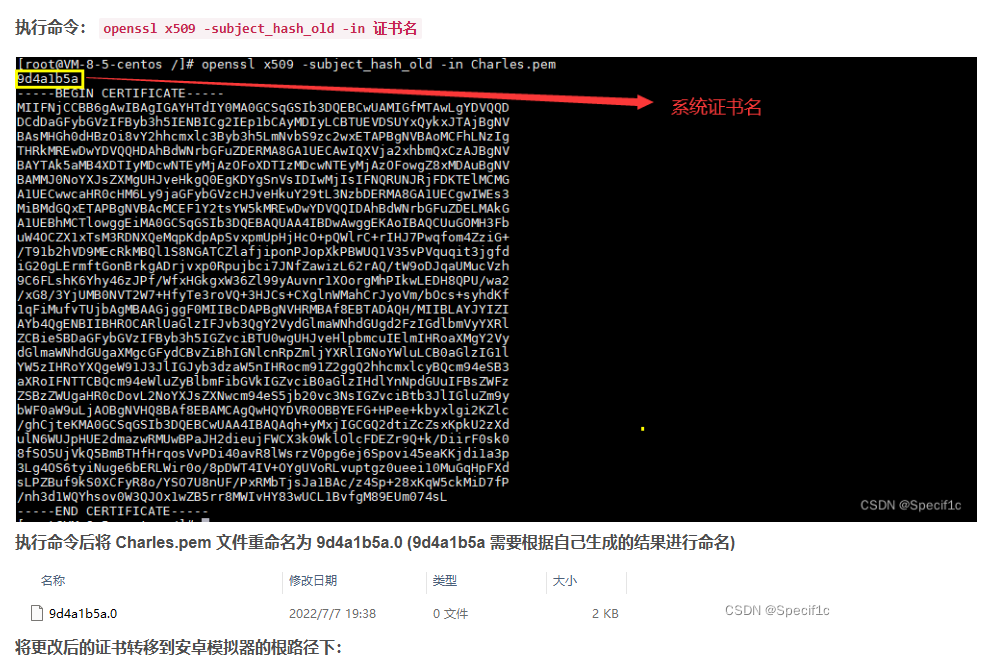

**所谓tls加密，其实就是https，或者是wss，但是wss也是https的升级。所以解密tls实际上就是解读https流量。**

### 问题场景

工具： mitmproxy,mumu模拟器12，clash，wireshake(可选)，openssl，adb调试

<!--more-->

mumu模拟器启动游戏，希望抓其传向服务器的包，实现一些自动化操作。由于游戏是日服，所以需要启用代理。我使用了clash。此外，游戏的包使用了tls1.3加密，要想截取必须获得在本地生成的密钥进行解密才能知道明文。中间人代理，我使用了mitmproxy。

### 问题显露

mitmproxy可以代理一个本地端口，在tls(https)流量进入进行握手阶段的时候，通过配置证书可以解读明文.但问题是流量必须走clash的，不然没梯子访问不了国外的服务器。而clash作为代理工具是没有保存该key的功能的。

### 思路

很自然的想法，让模拟器流量先走mitmproxy，而后再走clash作为流量出入口，mitmproxy作为模拟器和clash的中间人。这样就可以实现流量的截取和梯子转发，最后通过如wireshark这类的抓包工具进行数据包分析。



### 证书问题

这样看起来ok了，模拟器访问网页，在终端也可以看到mitmproxy的流量经过了。但是在启动游戏的时候，依然会看到如下报错：

> clinet TLS handshake failed. The client may not trust the proxys certificate for xxx.com(Openssl Error ssl routines , , tlsv1 alert access denied)

字面意思，mitmproxy 在进行 TLS 握手时，客户端无法信任 mitmproxy 的证书。通常情况下，mitmproxy 会自动生成一个伪造的证书来替代目标网站的真实证书，以便解密和转发流量。如果客户端（例如浏览器或模拟器）没有信任 mitmproxy 的证书，它就会拒绝与代理的安全连接。

**那就得在模拟器安装上mitmproxy的证书。**
默认情况下，mitmproxy 的证书存储路径是 ~/.mitmproxy/（Linux/macOS）或 C:\Users\<username>\.mitmproxy\（Windows），其中有一个文件叫 mitmproxy-ca-cert.pem。
将 mitmproxy-ca-cert.pem 证书文件传输到 Android 设备或模拟器。
打开设备的 设置，找到 安全性 或 证书管理，然后选择 从存储导入证书。
选择下载的证书文件并导入。
导入后，设备应该信任 mitmproxy 的根证书。

但是mumu12模拟器没有如上设置。并不是无他法。
第一步，安装openssl
第二步，把pem证书通过openssl转换为DER格式的证书

`openssl x509 -subject_hash_old -in mitmproxy-ca-cert.pem.pem`

第三步，重命名pem文件为 `哈希值.0`


```bash
adb root
adb remount
adb push xxxxxxx.0 /system/etc/security/cacerts/
```

**参考帖子：[https://blog.csdn.net/haduwi/article/details/125696208](https://blog.csdn.net/haduwi/article/details/125696208)**

### 结束

导入了证书后，mitmproxy的event log就没有报错了，美滋滋，开始用wireshark进行数据包分析吧。

<script src="https://giscus.app/client.js"
        data-repo="viogami/blog"
        data-repo-id="R_kgDOORWDyA"
        data-category="Announcements"
        data-category-id="DIC_kwDOORWDyM4Conxc"
        data-mapping="pathname"
        data-strict="0"
        data-reactions-enabled="1"
        data-emit-metadata="0"
        data-input-position="top"
        data-theme="preferred_color_scheme"
        data-lang="zh-CN"
        crossorigin="anonymous"
        async>
</script>
