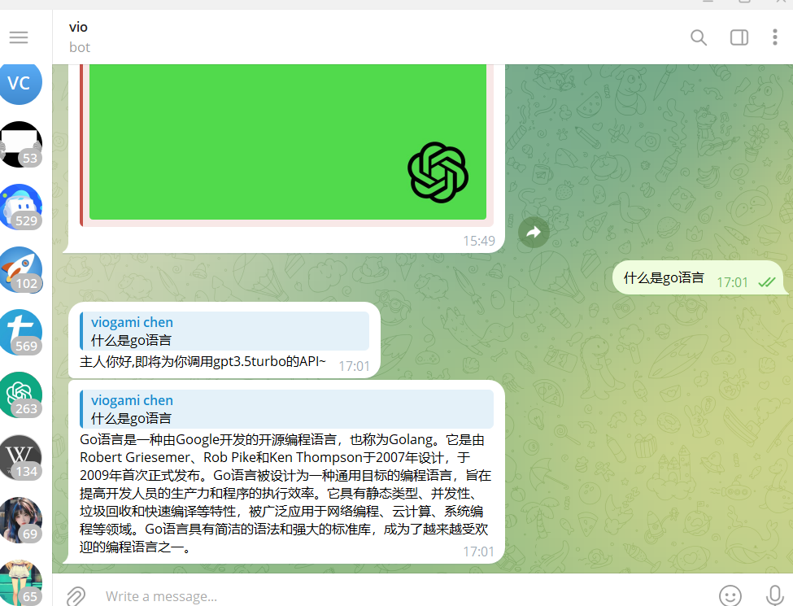

---
# general config
title: Telegram Bot部署
subtitle: 
date: 2023-12-07
authors:
  - viogami: author.png

# # card specific config
# summary: A summary of the blog post
# cardimage: photo1_card.jpeg

# # post specific config
# featureimage: photo1.jpeg
# caption: Some image caption
# toc: true
---

## 基本示例我放在了github上：[Gobot][1]

## 最终实现效果 👇👇👇

## 创建bot

从botfather处创建bot，命名为`vio`.
明确使用需求和目的，进而选择开发工具和相关库(主要使用go和colly库，tg官方也有go的api库)

<!--more-->

## 使用HTTPS

在Telegram的Bot API中，使用HTTPS是强烈建议的。如果Bot使用HTTP而不是HTTPS，Telegram服务器可能会拒绝处理请求。
为了确保Tg Bot能够正常运行并保障通信安全，最好使用HTTPS。许多服务提供商都提供免费的SSL证书.
如：**Let's Encrypt证书**，它是一种免费的、开源的证书颁发机构（CA），可以用来为服务器启用HTTPS，从而实现安全的Bot通信。

但是如果部署在paas平台，则无需考虑证书相关的问题，更多部署细节可以查看我 [仓库的说明][3]

## 响应方式

Telegram Bot有以下响应方式：

长轮询（Long Polling）： 这是一种常见的实时通信方式。Bot向Telegram服务器发送一个请求，然后服务器一直保持连接打开，直到有新消息到达。这样，Bot能够即时收到用户的消息并立即作出响应。长轮询是一种相对简单的方式，适用于需要实时性的场景。

Webhook： Webhook是一种更为高效和现代的方式。允许你在你的服务器上设置一个HTTP端点，当有新消息到达时，Telegram服务器会向这个端点发送POST请求。这样，你的Bot可以立即得知有新消息，并作出响应。使用Webhook能够避免频繁的轮询操作，提高效率。

云函数（Cloud Functions）： 你还可以将Bot的部分功能部署到云函数（如AWS Lambda、Google Cloud Functions等）上，以响应特定的事件。这样可以实现高度的可伸缩性和响应性。

## webhook

为了有较好的实时通信体验，并且完成多方通信，我准备使用webhook的方案。

**设置Webhook端点**： 在我服务器上，创建一个HTTP端点来接收Telegram的Webhook请求。这个端点需要运行在公共网络上，并且能够处理POST请求。这个端点将会接收到所有的Telegram消息。

**配置Bot的Webhook**： 使用Telegram Bot API设置Bot的Webhook，指向刚刚创建的HTTP端点。可以使用NewWebhook方法，指定Webhook的URL(我部署在paas平台上，无需使用证书密钥)。

## paas平台部署

我选择了zeabur这个服务提供平台,

zeabur上项目部署非常快,甚至不用写dockfile,而且对go项目有完整的支持,算是符合他们的口号:

>Deploying your service with one click

在使用paas服务时，需要注意项目的端口号设置,最好设置在环境变量中,然后在项目中通过`os.Getenv("xxx")`来获取端口号.

zeabur的go项目中，环境变量PORT是默认8080，且为全局的。也可以不设置，直接调用就好了。

- 对于tgbot：官方示例中使用的8443端口，在部署到paas平台时8443端口需要确认是否开放。 我建议不要使用官方示例中把端口号写明的写法，通过环境变量PORT调用端口号，避免webhook创建失败，或者监听未开放的端口等问题。

## 调用chatGPT API

### 首先获取密钥

但是注意，不是申请了账号密钥就可以使用的，只有三个月内注册的账号每个月有免费的5$的额度。如果没有额度，申请的密钥也是无法使用的。很多购买的GPT的账号，api基本都是没额度或者额度每个月都被其他人用完的，可以使用国内的中转代理，来解决密钥的问题。 我推荐一个：[柏拉图次元Al][4]

### GPT代理问题

注意：如果使用中转，需要更换post请求的URL

使用go-openai库后，需要更改config
更多细节可以查看服务提供商的文档，以及这个[issue][5]

示例：`URL："https://api.example.com/v1"`.
其中后面的“v1”是必须的

### 实现数据处理逻辑

对于tgbot来说，私聊要回复信息需要知道user的id或者username，但是在群里中需要知道chat的id。

注意，tg的群组分为group和supergroup，公开的群组都是supergroup，只有私群是group。

设置了消息处理逻辑，如果想直接用chatgpt的api来聊天，写一个函数调用就可以了。

对于go语言来说，有一个以及封装好的，对于openai API使用的库：[go-openai][6]

### 重新部署

把chatGPT的API密钥写在环境变量中，redeploy服务就好了

  [1]: https://github.com/viogami/Gobot-vio
  [3]: https://github.com/viogami/Gobot-vio#%E8%AF%81%E4%B9%A6%E9%97%AE%E9%A2%98
  [4]: https://one-api.bltcy.top/
  [5]: https://github.com/sashabaranov/go-openai/issues/513#issuecomment-1851585302
  [6]: https://github.com/sashabaranov/go-openai

