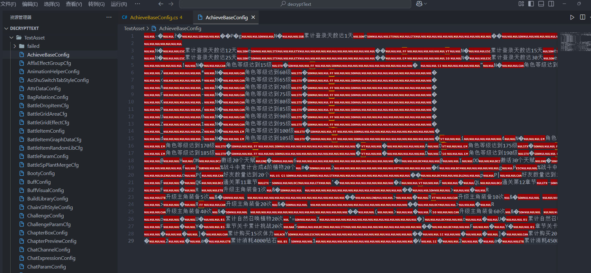
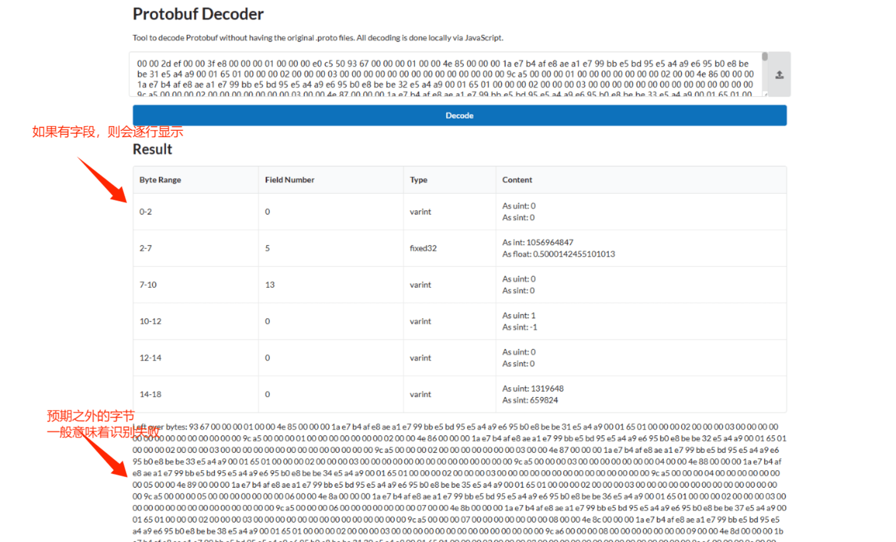
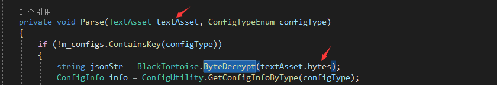
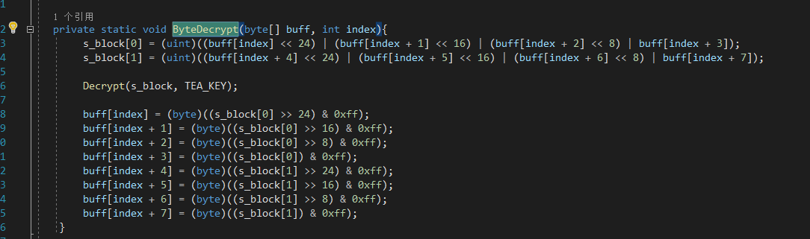
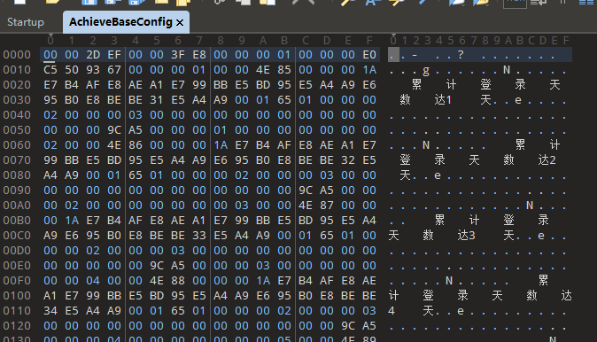
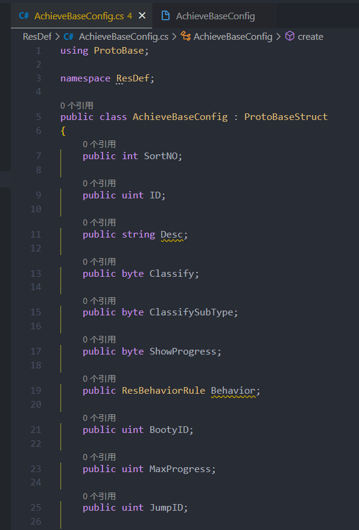
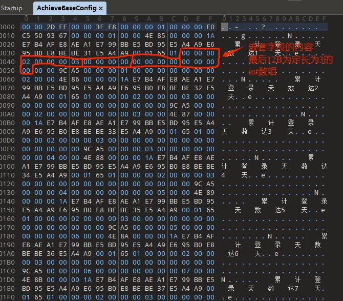

---
# general config
title: 【逆向】解决unity导出TextAsset后部分文本出现乱码
subtitle: 
slug: decrypt-textasset-Garbled
tags: 
  - Unity
  - 逆向
  - 游戏开发
  - 二进制文件
  - protobuf
  - json
  - C#
summary: 该文件是通过解包软件从ab包直接导出的，不存在ab包加密的问题。既然部分文本可读，那么该文件加密的可能性很小，部分加密这种也太小众了。
date: 2025-01-06

# card specific config
authors:
  - viogami: author.png
---

问题预览。可以看到，这是个配置文件，但是只有部分文本可读。



该文件是通过解包软件从ab包直接导出的，不存在ab包加密的问题。
既然部分文本可读，那么该文件加密的可能性很小，部分加密这种也太小众了。

既然是游戏工程项目，考虑两个方向：是否是用protobuff读取的二进制文件；是否是直接用读取字节流的方式读取的配置文件。

### 是否是pb的二进制文件？

直接拿到导出的二级进制文件导出到该网站识别：
<https://protobuf-decoder.netlify.app/>



可以看到，没有识别出合适的字段名。据此判断该文本文件不是pb的二进制文件。

### 是否是按字节流读取的文本？

按照字节流读取文本，这在客户端中不少见, 因为比json省空间, 但缺点是可读性为0, 我的评价就是狗屎, 你少出几张宽高不是4的整倍数的图, 这都不用扣这点配置表省的空间。。在源码中可能是这样出现的：



使用010 editor打开该二进制文件。逐字节进行观察分析：所有配置文件都有相同的4B文件头，随后是文件长度的16进制，然后是相同的4B字节“00 00 00 01”,再之后是配置文件的配置项数，最后是4B的校验比特。总之就是开头的20B为配置文件的描述文件头。


### 获得二进制文本的字段描述

此处需要逆向代码，由于是ill2cpp打包的，只能dump出函数名，但也够用了。在dnspy中搜索和配置文件同名的项，可以找到一个定义了所有配置文件model的文件夹**ResDef**。其中定义了配置文件的字段内容：


该项目确实是用protobuff进行通信的，但配置文件还是json格式的，其中配置字段也符合json嵌套的格式。我们逐比特进行字段解读，发现字节流确实是可读的。其中需要注意以下三点：

- 这种由开发者自定义的二进制文件，一般都是**大端序**读取的字节，直接用`readbytes`方法不合适，要逆序一下。
- 注意其中的string类型的比特编码方式，一般是由4B文件指定长度，后面该长度的字节编码为字符串。
- 注意数组类型在字节流文件中的编码方式，可能和字符串一样用4B指定长度，也可能是定长编码。本示例项目中就是定长编码，所有数组大小都固定为3。

配置字段的定义如下：

```csharp
public class AchieveBaseConfig : ProtoBaseStruct
{
 public int SortNO;

 public uint ID;

 public string Desc;

 public byte Classify;

 public byte ClassifySubType;

 public byte ShowProgress;

 public ResBehaviorRule Behavior;

 public uint BootyID;

 public uint MaxProgress;

 public uint JumpID;
}
public class ResBehaviorRule : ProtoBaseStruct
{
 public int ID;

 public int Type;

 public int[] Param;
}

```

逐比特对比，符合字段的定义：


### 编写解密代码

编写解密函数类BinaryConfigParser，根据字段类型逐行读取，注意大小端处理，字符串和数组类型处理以及嵌套类型的处理(需要递归)，最后在主函数中调用。如下只给出主函数的调用部分，`BinaryConfigParser`类过长，且解码不同二进制文件方法也不相同，就未放出，如需要可留言。

```csharp
using Newtonsoft.Json;

class Program
{
    // 解码二进制文件
    static void Decode(string fileName, int arrayLen)
    {
        string binaryFilePath = $"TextAsset\\{fileName}"; // 替换为实际的二进制文件路径

        // 动态获取类型
        Type type = Type.GetType($"ResDef.{fileName}");
        // 动态调用泛型方法
        var method = typeof(BinaryConfigParser).GetMethod("ReadConfigArray").MakeGenericMethod(type);
        
        // 读取配置项
        var configs = method.Invoke(null, new object[] { binaryFilePath, arrayLen });

        // 保存为 JSON 数组格式
        string jsonArray = JsonConvert.SerializeObject(configs, Formatting.Indented);

        // 保存到文件
        string jsonOutputPath = $"output_json\\{fileName}.json"; // 替换为实际的 JSON 要存放的文件路径
        File.WriteAllText(jsonOutputPath, jsonArray);
        
        Console.WriteLine($"文件 {fileName} 已解码为 JSON 文件: {jsonOutputPath}");
    }
    
    //自动化解码
    static void AutoDecode()
    {
        string textAssetFolder = "TextAsset";
        string outputFolder = "output_json";

        // 确保输出文件夹存在
        if (!Directory.Exists(outputFolder))
        {
            Directory.CreateDirectory(outputFolder);
        }
        // 获取TextAsset文件夹下的所有文件
        var files = Directory.GetFiles(textAssetFolder);

        // 遍历所有文件
        foreach (var filePath in files)
        {
            string fileName = Path.GetFileName(filePath);
            string outputJsonPath = Path.Combine(outputFolder, $"{fileName}.json");

            // 检查是否已生成JSON文件
            if (!File.Exists(outputJsonPath))
            {
                try
                {
                    // // 输入固定数组长度,由于长度未知,所以循环100次，直到找到正确的长度
                    // for (int arrayLen = 0; arrayLen < 100; arrayLen++)
                    // {
                    //     // 调用Decode生成JSON
                    //     Decode(fileName, arrayLen);
                    // }
                    int arrayLen = 3;
                    Decode(fileName, arrayLen);
                }
                catch (Exception ex)
                {
                   Console.WriteLine($"处理文件 {fileName} 失败！"+ex.Message);
                }
            }
        }
    }
    
    // 程序入口
    static void Main()
    { 
        AutoDecode();
    }
}

```

<script src="https://giscus.app/client.js"
        data-repo="viogami/blog"
        data-repo-id="R_kgDOORWDyA"
        data-category="Announcements"
        data-category-id="DIC_kwDOORWDyM4Conxc"
        data-mapping="pathname"
        data-strict="0"
        data-reactions-enabled="1"
        data-emit-metadata="0"
        data-input-position="top"
        data-theme="preferred_color_scheme"
        data-lang="zh-CN"
        crossorigin="anonymous"
        async>
</script>
