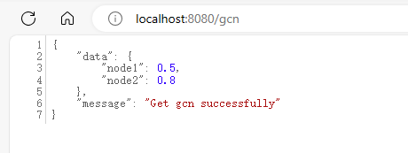

---
# general config
title: 使用grpc在go后端和python服务间通信
subtitle: 
date: 2024-03-21
authors:
  - viogami: author.png

# # card specific config
# summary: A summary of the blog post
# cardimage: photo1_card.jpeg

# # post specific config
# featureimage: photo1.jpeg
# caption: Some image caption
# toc: true
---


## grpc前言

gRPC是Google 开发的高性能、开源的远程过程调用（RPC）框架，
基于 HTTP/2 协议进行通信，使用 Protocol Buffers（protobuf）作为接口定义语言，可以看为一种协议。
**grpc可以用于各种不同服务间的通信，屏蔽底层细节(如编程语言，操作系统等)**

由于我的一个go后端(也可以不是go)需要实现神经网络相关的功能，我要调用一个python的服务，于是想到了使用grpc的方式。

初次接触，将从0介绍到功能实现。

<!--more-->

感谢官方的文档

> <https://grpc.io/docs/languages/go/quickstart/>

## 主要流程

- 定义.proto文件：创建一个 .proto 文件，定义图数据和 GCN 结果的消息类型以及服务接口。
- 生成 gRPC 代码：使用 Protocol Buffers 编译器 protoc，根据 .proto 文件生成 Go 和 Python 的 gRPC 代码。
- 实现 Python 服务器：在 Python 中实现 gRPC 服务器，接收来自 Go 客户端的图数据，进行 GCN 处理，并返回处理结果。
- 实现 Go 客户端：在 Go 中实现 gRPC 客户端，发送图数据到 Python 服务器，并接收处理结果。

## 安装protoc解释器

grpc是通过pb(protocolbuffer)这个协议工作的，首先安装protoc的解释器，并将其bin文件夹添加到环境变量。
地址：<https://github.com/protocolbuffers/protobuf/releases>
下载后解压到任意文件夹位置，然后将解压后的bin文件夹添加到环境变量。

打开cmd输入 `protoc`有数据返回就ok了。

**为了在项目中使用protoc的一些指令可以正常工作，还有把bin文件下的 `protoc.exe`文件复制一份到 `C:\Windows\System32`文件夹下。**

顺便一提，为了proto文件可以在vscode高亮显示，可以安装官方的插件：protobuf，作者：pbkit

## go端工作

首先安装go的grpc库

```go
go get -u google.golang.org/grpc
```

然后安装可以将proto文件自动解析为go文件的解释器：

```go
go install google.golang.org/protobuf/cmd/protoc-gen-go
go install google.golang.org/grpc/cmd/protoc-gen-go-grpc
```

定义proto文件 `gcn.proto`：
其中go_package是指定生成的文件位置和文件所在包名。“.” 表示文件生成在当前目录，“；”表示参数分割，后面的proto是将生成文件放在proto包中。
还有更多可选参数，自行参考官方

> go_package：指定生成 Go 代码时的包路径，格式为 option go_package = "package_path";，用于将生成的代码放置在指定的 Go 包中。
>
> java_package：指定生成 Java 代码时的包路径，格式为 option java_package = "package_path";，用于将生成的代码放置在指定的 Java 包中。
>
> java_outer_classname：指定生成 Java 代码时的外部类名，格式为 option java_outer_classname = "ClassName";，用于指定生成的 Java 类的外部类名。
>
> cc_generic_services：指定是否生成 C++ 通用服务（generic services），格式为 option
> cc_generic_services = true; 或 option cc_generic_services = false;，默认为
> true。
>
> cc_enable_arenas：指定是否启用 C++ arenas 内存管理，格式为 option cc_enable_arenas =
> true; 或 option cc_enable_arenas = false;，默认为 false。
>
> optimize_for：指定优化选项，可以是 SPEED、CODE_SIZE 或 LITE_RUNTIME，格式为 option
> optimize_for = SPEED;，默认为 SPEED。
>
> deprecated：指定消息或字段已过时，格式为 option deprecated = true;。
>
> rpc_timeout：指定 gRPC 调用的超时时间，格式为 option rpc_timeout = "10s";，表示超时时间为 10
> 秒。

gcn.proto协议文件具体定义为：

```go
syntax = "proto3";

option go_package = ".;proto";

message Node {
  string id = 1;
  repeated float features = 2;
}

message Edge {
  string source_id = 1;
  string target_id = 2;
}

message GraphData {
  repeated Node nodes = 1;
  repeated Edge edges = 2;
}

message GCNResult {
  map<string, float> node_scores = 1;
}

service GCNService {
  rpc ProcessGraph(GraphData) returns (GCNResult);
}
```

我这里是用来处理图数据。

接下来生成 gRPC 代码：

```go
protoc --go_out=. --go_opt=paths=source_relative your_proto_file.proto
protoc --go-grpc_out=. --go-grpc_opt=paths=source_relative your_proto_file.proto
```

会生成两个文件 `gcn.pb.go`和 `gcn_grpc.pb.go`

- 前者生成的文件，包含所有pb协议的go代码，将数据格式写为go的结构体形式。包含填充、序列化，检索请求和响应消息类型。
- 后者包含**客户端**使用中定义的方法，调用的接口类型。以及**服务端**要实现的接口类型。包含创建客户端服务和服务端服务的方法。
  **请注意，无论go后端作为请求grpc的一方(client)还是做出响应的一方(server),这两个文件都是必须生成的。**
  使用 `client := pb.NewXXXXServiceClient(conn)`的方式创建客户端

最后就是完成go端的grpc请求代码，每次请求都创建一个grpc的连接，请求完毕defer断开：

```go
func GCN_request() (map[string]float32, error) {
 conn, err := grpc.Dial("localhost:9999", grpc.WithTransportCredentials(insecure.NewCredentials()))
 if err != nil {
  // Failed to connect to gcnserver(py) by grpc
  return nil, err
 }
 defer conn.Close()

 client := pb.NewGCNServiceClient(conn)

 // 创建一个实例的图数据
 G_example := &pb.GraphData{
  Nodes: []*pb.Node{
   {Id: "node1", Features: []float32{0.1, 0.2, 0.3}},
   {Id: "node2", Features: []float32{0.4, 0.5, 0.6}},
  },
  Edges: []*pb.Edge{
   {SourceId: "node1", TargetId: "node2"},
  },
 }

 // 发送请求并接收响应
 result, err := client.ProcessGraph(context.Background(), G_example)
 if err != nil {
  // Error calling ProcessGraph
  return nil, err
 }
 return result.NodeScores, err
}
```

最后的最后别忘了创建一个路由调用这个方法。

## python端工作

py同样安装grpc相关库

```python
pip install grpcio
pip install grpcio-tools

```

### 生成grpc文件

终端cd到proto文件目录下，执行：

```python
python -m grpc_tools.protoc -I ./ --python_out=./ --grpc_python_out=. your-file.proto

```

py的服务端代码grpc相关的代码较为简洁，重点在于数据处理。将其服务端口和grpc客户端的请求端口保持一致。
部分代码取自官方示例。

```python
import grpc
from concurrent import futures
from proto import gcn_pb2_grpc, gcn_pb2

class GCNServicer(gcn_pb2_grpc.GCNServiceServicer):
    def ProcessGraph(self, request, context):
        # Process graph data using GCN and return result
        # example: return gcn_pb2.GCNResult(node_scores={"node1": 0.5, "node2": 0.8})

def server():
    server = grpc.server(futures.ThreadPoolExecutor(max_workers=10))
    gcn_pb2_grpc.add_GCNServiceServicer_to_server(GCNServicer(), server)
    server.add_insecure_port('[::]:9999')
    server.start()
    print('gRPC 服务端已开启,端口为9999...')
    server.wait_for_termination()

if __name__ == '__main__':
    server()

```

## 启动

做好了以上工作就大功告成了，启动两个服务即可

`go run main.go`

`python server.py`

然后访问定义的路由地址，如下显示，nice~


<script src="https://giscus.app/client.js"
        data-repo="viogami/blog"
        data-repo-id="R_kgDOORWDyA"
        data-category="Announcements"
        data-category-id="DIC_kwDOORWDyM4Conxc"
        data-mapping="pathname"
        data-strict="0"
        data-reactions-enabled="1"
        data-emit-metadata="0"
        data-input-position="top"
        data-theme="preferred_color_scheme"
        data-lang="zh-CN"
        crossorigin="anonymous"
        async>
</script>
