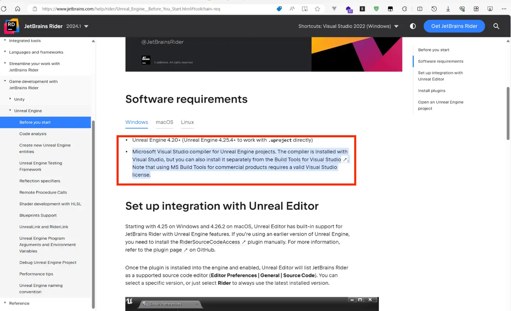
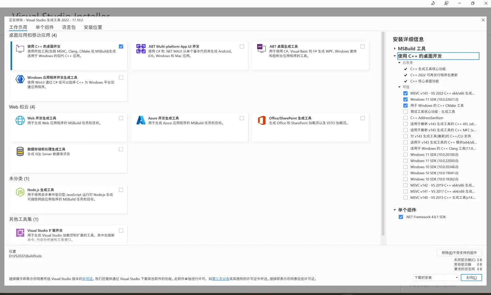

从UE5官方文档来看，要下的负载还是很多的。但查看rider官方文档，只要我们下一个vs的工具集就ok了，那就试试看。

**下载 Visual Studio Build Tools：**

访问 Visual Studio 官方网站 下载 Visual Studio Build Tools。

运行安装程序，选择所需的组件：

- 选择“**C++ build tools**”，这是最重要的部分。
在安装选项中选择：
MSVC v142 - VS 2019 C++ x64/x86 build tools（或更高版本,我用2022）
Windows 11 SDK（win10或更高版本）
C++ CMake tools for Windows

- 选择“**单个组件**”中的.NET框架SDK。

开始安装，等待安装完成。

**配置 Unreal Engine 5**
在完成上述步骤后，可以配置 Unreal Engine 5 使用这些工具来编译项目。

1.启动 Unreal Engine 5 并打开项目。
2.转到“编辑” -> “项目设置”。在左侧菜单中找到“平台” -> “Windows”。确认编译器路径 指向刚安装的 MSVC 编译工具，vs2022。
3.转到”编辑器偏好设置“ ->"通用" -> "源代码" ，选择编辑器为 "rider"

----------

这样就完成了最轻量的使用rider做编辑器进行UE5开发了，**不下载vs2022的编辑器，只下载必要构建工具，编辑器使用rider**。

