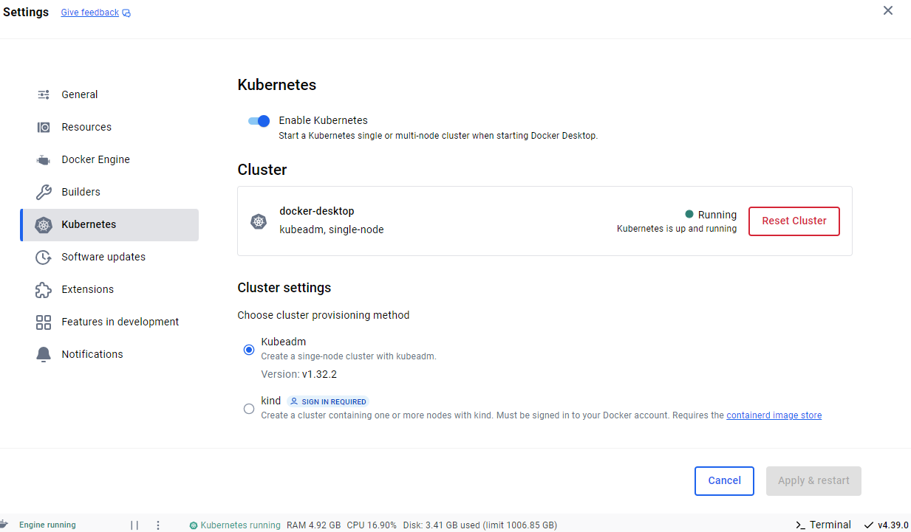
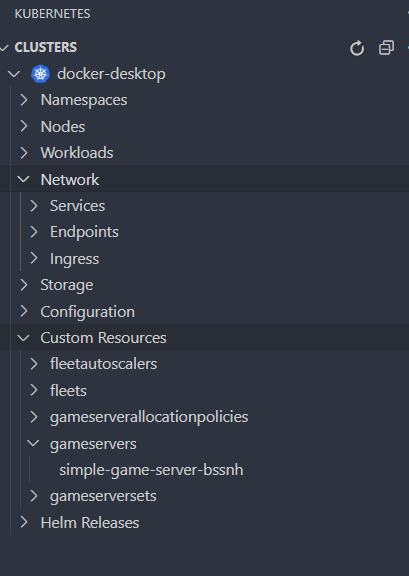
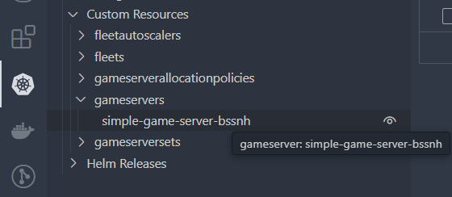
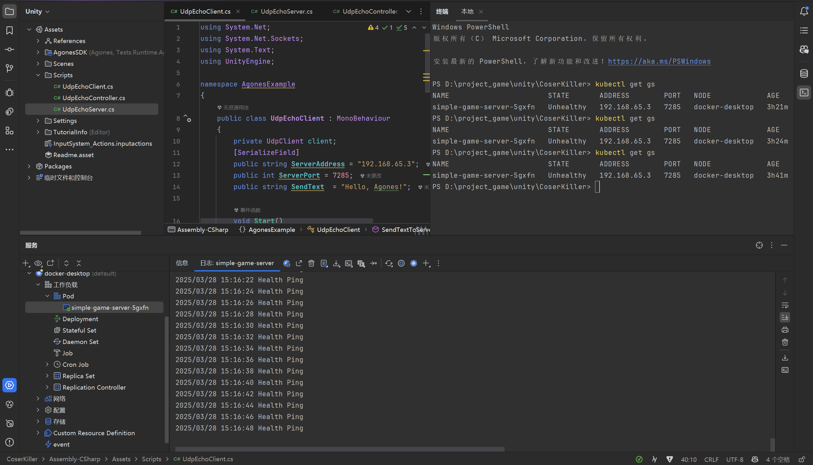

学一个新事物从底层理论学肯定是最系统的，但不是最工程的。对于K8S，我个人认为相比苦苦理解各种集群，节点，pods等等概念，不如实际上手一次，从实践上逐步理解理论，自顶向下才是最快最高效的学习模式，因为目的是使用K8S，是工程化，而不是了解k8s架构，设计云云。
<!--more-->

**本文基本从0开始部署Agones，进而逐步理解docker，理解K8S。**

相信如果你能发现本文，自然了解Agones是什么，如果不知道自行了解下，不做多介绍，引用官方介绍：

> Agones 是一个开源平台，用于部署、托管、扩展和编排专用游戏服务器，用于大型多人游戏，构建在行业标准的分布式系统平台
> Kubernetes 之上。

部署Agones只是一个任务性的引子，重点还是K8S.

## 准备工作

### 安装docker-desktop

由于我是win机器，在一切之前，得介绍下开发环境，但很简单。
首先得安装docker，注意如下：

- **打开任务管理器，看看cpu有没有开启虚拟化，没有则在bios设置中开启。(必要)**
- 安装wsl，无需开启hyper-v,所以家庭还是专业版的windows没啥影响。
- 自备代理工具，docker官网需要魔法。

**安装完docker基本就完成了。**

由于是个人开发测试用，只用**部署一个单节点集群**就好了，而这在docker-desktop中已经集成了，很方便，如下所示，打开即可：



```bash
kubectl get nodes
```

如果返回类似 Ready 状态的节点，说明 Kubernetes 已经启动成功。

*注意 ❌：Docker Desktop 的 Kubernetes 只能运行在单个节点上，不适用于生产环境的高可用集群。*

### vscode的K8S插件

安装桌面版的docker是有图形化界面的，很直观，但K8S目前我们是没有GUI的，需要吗？并不一定，使用gui会更多的限制你。
Kubernetes 本身主要是通过 kubectl 命令行工具和 YAML 配置文件进行管理的。

虽然有 `kubernetes-dashboard`，但别着急，在vscode的插件也有gui可以打开dashboard。推荐安装docker和k8s插件，在vscode中集成开发，然后我逐步解释下插件中每个显示项的作用，**从这里就开始理解如何使用K8S辣**



- Namespace（命名空间）Kubernetes 内部的逻辑隔离单位，用于划分不同的应用、环境或团队。一个集群可以包含多个 Namespace，**每个 Namespace 内的资源相互独立**。
- Workloads（工作负载）管理 Kubernetes 里运行的应用程序，本质上就是 运行 Pod 的控制器。Workload 负责定义应用如何部署、扩缩容、更新和运行。
- Network（网络） 负责 Kubernetes Pod 之间、Pod 和外部系统之间的通信。管理 Service、Ingress、Network Policy 这些 K8s 网络资源。
- Storage（存储）管理 Kubernetes 里的持久化存储，确保 Pod 重新启动后数据不会丢失。Volume 只在 Pod 生命周期内有效，但 PersistentVolume（PV）可持久存储数据。
- Configuration（配置管理）管理应用的配置信息、环境变量、Secrets（敏感信息）。让应用和环境解耦，比如可以在不修改代码的情况下更改应用配置。
- Custom Resource（自定义资源）扩展 Kubernetes，增加新的资源类型，比如 Agones 添加了 GameServer 资源。允许你 创建自己的 K8s API，以适配特定的业务需求。
- Helm Releases（Helm 版本管理）管理 Helm 安装的应用（比如 agones）。**Helm 是 Kubernetes 的包管理工具**，可以一键安装、更新、删除复杂应用。

#### 但Docker Desktop 不包含K8S的包管理工具 Helm

但安装了K8S插件会自动提示下载 `kubectl`和 `helm`，前者是命令行操作工具。都是编译好的exe。如果需要可以配到环境变量中，位置在 `.../user/.vs-kubernetes`下

## 提出疑问-区别概念

好了，在部署之前，安装了上文所说的插件，如果刚入门K8S，难免有一些疑问，下面我着重进行些概念补充，希望下面可以顺利进行~

### Kubernetes 中 Node 和 Pod 的关系

Node（节点）就是机器，它可以是：物理机（裸机服务器），虚拟机（云服务器、Docker Desktop 里的虚拟 K8s 节点），你的本机（如果你用 Docker Desktop Kubernetes）

Pod（Pod 是容器的封装单位），Pod 运行在 Node上，一个Pod 里面可以有一个或多个容器，Pod共享存储（Volume）、网络（IP 地址）等，K8s 只管理 Pod，不直接管理容器

如果 Kubernetes 是一个数据中心：

- Node = 一台服务器
- Pod = 服务器上的一个应用进程组（可能包含多个容器）
- 容器 = 运行的进程（比如 Nginx、MySQL 等）

### 现实中，一个项目是不是只要一个k8s集群就够了？

**YES！一个 Kubernetes 集群足够应付绝大部分的项目需求，包括扩展、弹性、资源管理和容器的自动化部署。**

一个K8S集群中会有很多nodes，这些nodes就是物理上的机器，可以有很多个，每个nodes里有很多pods，pods才是实际的部署的应用。nodes已经完成了分布式，多集群可能确实在大型复杂项目的跨地区部署中用到，但咱可以不用了解

### 命名空间和nodes有什么区别，为什么有了nodes还需要namespace

- Nodes（节点） 物理或虚拟机，负责运行 Pod 实际的计算资源（CPU、内存、存储）
- Namespace（命名空间） 逻辑隔离的环境，管理不同的 K8s 资源 逻辑上的组织单位，不影响物理资源分配
  *可以把 Node 理解为 "真实的服务器"，而 Namespace 更像是 "应用的文件夹或项目空间"*

## 安装Agones

好了，终于来到重点也不算是重点的部分了。

### 但并不重要，因为你可以根据[官方文档](https://agones.dev/site/docs/installation/install-agones/yaml/)逐步操作

根据agones官方文档，安装可以通过yaml文件，也可以通过helm包管理安装。

我是用kubectl命令行拉取的yaml文件完成的安装

```bash
kubectl create namespace agones-system
kubectl apply --server-side -f https://raw.githubusercontent.com/googleforgames/agones/release-1.48.0/install/yaml/install.yaml

```

然后你就可以在 `Custom Resource`中发现拉去下来的服务了！



接下来按照官方文档操作进行部署了，并不赘述，因为本文不是介绍怎么部署agones。



本人使用rider及其K8S插件，在游戏开发的时候进行服务器集群控制的。记住命令行得到pod的ip和端口，接下来就是网络通信的知识了。如果要在unity中和部署的服务器应用通信，自写和后端的通信协议，Agones只是个后台应用调度工具，不涉及和前端交互。

**注意 ❌ Agones Unity SDK 适用于 服务器端（GameServer） 的 Unity 进程而不是前端！**

例如：你用 Unity 制作了一款 服务器端模拟的游戏逻辑，需要让 Agones 调度这个服务器。或者你的游戏服务器是 Unity 编写的，想要与 Agones 交互来管理它的生命周期。但是，**如果你想让 Unity 客户端 连接到 GameServer，那 Unity SDK 并不需要。客户端应该直接用 WebSocket、TCP、UDP、HTTP 连接 GameServer。**

## 结束

怎么就结束了？
因为从安装agones敲下一行命令行开始，已经完成了一次K8S的体验，只要了解从0到启动一个K8S单节点集群的全过程每个操作的意义，那么恭喜你，已经入门K8S了，就这么简单，剩下的内容需要在一次次部署应用，一次次开关容器中不断积累吧。这不是整体图看这个概念那个概念是什么意思可以解决的。

怎么用kubectl操作，怎么用helm包管理，这就是启动K8S后亟待解决的唯二的问题，在实践中结束吧！

### 如果你有任何疑问，都可以评论联系我~

<script src="https://giscus.app/client.js"
        data-repo="viogami/blog"
        data-repo-id="R_kgDOORWDyA"
        data-category="Announcements"
        data-category-id="DIC_kwDOORWDyM4Conxc"
        data-mapping="pathname"
        data-strict="0"
        data-reactions-enabled="1"
        data-emit-metadata="0"
        data-input-position="top"
        data-theme="preferred_color_scheme"
        data-lang="zh-CN"
        crossorigin="anonymous"
        async>
</script>
