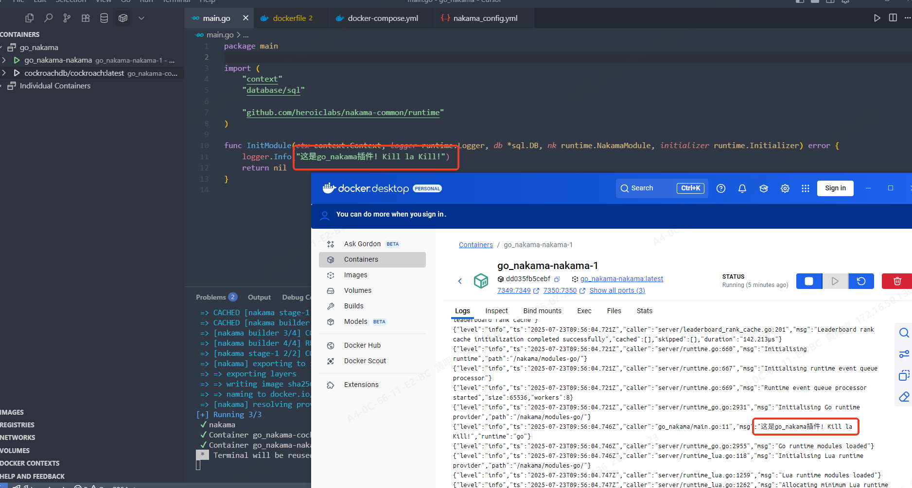

第一步 下载nakama
第二步 docker拉去cockroachDB
第三步 运行数据库迁移：`nakama.exe migrate up`
第四部 启动nakama

<!--more-->

您可以通过将浏览器导航到127.0.0.1:7351来访问Nakama控制台。

提示登录时，默认凭据为admin:password

可以使用--config标志在运行时指定配置文件。

    nakama --config my-special-config.yml

Nakama系统非常灵活。您可以通过gRPC, HTTP, Websockets和rUDP与服务器交换数据。由于这种灵活性，Nakama需要4个端口可用于绑定到：

在端口7350上绑定到HTTP API服务器可以在配置中更改端口。
在7351端口上绑定到HTTP API服务器，这个服务器启动嵌入式开发人员控制台。可以在配置中更改端口。
在端口7349上绑定到gRPC API服务器。根据API服务器端口选择端口。
在7348端口上绑定到gRPC API服务器，该服务器启动嵌入式控制台。根据API服务器端口选择端口。



可以使用编译插件的方式实现对nakama的自定义内部实现，通过编写docker-compose文件，使用官方镜像，可以实现热更(主要依赖于go的编译极快，和热更一样)

docker-compose:

```yaml
services:
  nakama-build:
    image: heroiclabs/nakama-pluginbuilder:3.28.0
    volumes:
      - ./:/go_nakama       
    working_dir: /go_nakama
    entrypoint: ["sh", "-c"]
    command: ["go build --trimpath --buildmode=plugin -o ./data/go_test.so && echo 'Build .so file completed'"]

  nakama:
    # build: .    发布才构建，开发用镜像生成so
    image: heroiclabs/nakama:3.28.0
    entrypoint:
      - "/bin/sh"
      - "-ecx"
      - >
          /nakama/nakama migrate up --database.address root@cockroachdb:26257 &&
          exec /nakama/nakama --name nakama --config /nakama/data/nakama_config.yml
    restart: "no"
    depends_on:
      cockroachdb:
        condition: service_healthy
    volumes:
      - ./data:/nakama/data
    expose:
      - "7349"
      - "7350"
      - "7351"
      - "9100"
    ports:
      - "7349:7349"
      - "7350:7350"
      - "7351:7351"
    healthcheck:
      test: ["CMD", "/nakama/nakama", "healthcheck"]
      interval: 30s
      timeout: 5s
      retries: 5  
    
  cockroachdb:
    image: cockroachdb/cockroach:latest
    command: start-single-node --insecure --store=attrs=ssd,path=/var/lib/cockroach/
    restart: "no"
    volumes:
      - cockroachData:/var/lib/cockroach
    expose:
      - "8080"
      - "26257"
    ports:
      - "26257:26257"
      - "8080:8080"
    healthcheck:
      test: ["CMD", "curl", "-f", "http://localhost:8080/health?ready=1"]
      interval: 3s
      timeout: 3s
      retries: 5
volumes:
  cockroachData:
```

发布阶段建议将build的so文件到dockerfile中打包发布，更安全，更适合生产，docker-compose中编译插件只建议开发环境使用
dockerfile:

```dockerfile
FROM heroiclabs/nakama-pluginbuilder:3.28.0 AS builder

ENV GO111MODULE on
ENV CGO_ENABLED 1

WORKDIR /go_nakama
COPY . .

RUN go build --trimpath --buildmode=plugin -o ./go_test.so

FROM heroiclabs/nakama:3.28.0

COPY --from=builder /go_nakama/go_test.so /nakama/data/go_test.so
```
