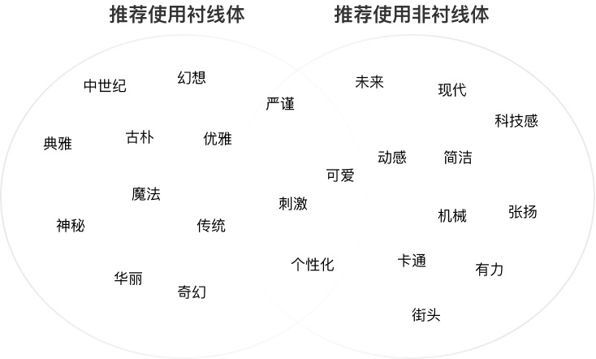

## 系统字与艺术字

不管是衬线体还是非衬线体，需要作为游戏的系统字体时，都需经过授权才可以合法使用。由于游戏包体大小和压缩限制的原因，游戏中不能放置太多的字体，往往标题字和系统字都各选一种。而如果游戏中的所有文字都仅使用系统字不免会有些单调，因此开发者需要在字体使用上做出权衡。

为了满足游戏中一些特殊的需求，如活动标题、游戏名字等，开发者可能需要使用一些艺术字或手写字体。艺术字有时是针对现有字体的变形和修饰，有时候也会是更为复杂的改变；而手写字体通常更加自然、柔和，风格化更强，有时候会由专业书法家进行设计。

那么，应该如何选择系统字或艺术字？我们应当考虑文字在游戏中所起到的作用。不同作用的文字会存在不同的设计和处理方式。一般情况下设计游戏界面所使用到的字体种类越少越好，尽可能通过视觉层次原则，例如字体的不同权重、样式、大小、方向、位置、颜色等来体现重要性差异。

## 字幕与对话

字幕和对话用于推进剧情和进行游戏引导，要尽可简洁。

通常使用清晰、易读的字体，如微软雅黑、思源黑体等非衬线体字体。这些字体在不同屏幕尺寸和分辨率下都能保持良好的可读性，确保玩家能够轻松理解游戏中的信息和指引。同时，字幕和对话的字体大小和行距也需要适当调整，以提高阅读体验，避免过于拥挤或过于稀疏的排版。
