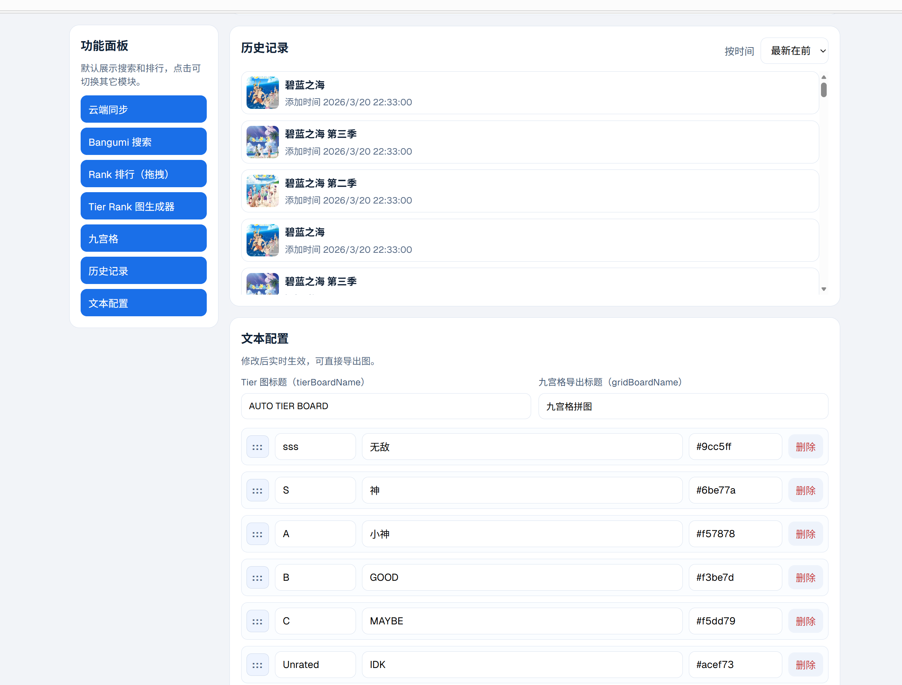
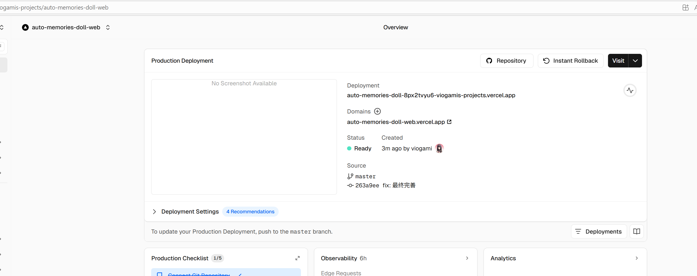
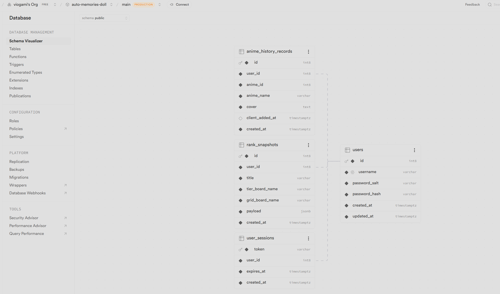
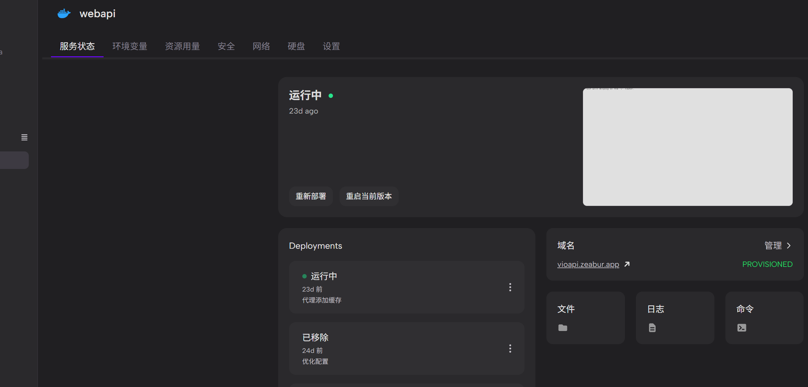

## auto-memories-doll 👉[立即体验](https://auto-memories-doll-web.vercel.app/)

跨端动漫管理应用（Web + Mobile），前端为静态页面，可以单独启动，数据保存在本地。

`C.H`文件夹下为后端代码，为支持保存的数据上传云端。go原生库编写，实现非常简单，也非常高效。
👉[后端文档](./be.md)

核心功能：

- Bangumi 搜索
- 个人收藏列表总览
- Rank 拖拽排序 + Tier（S/A/B/C/Unrated）
- tier rank图生成器
- 九宫格生成与排序，导出 PNG！
- 动画收藏历史记录，记录你的时刻！
- rank等级文本，颜色，完全自定义配置！
- 支持上传云端，永远保存你的记录！

| 效果图                                  | 效果图                                  |
| --------------------------------------- | --------------------------------------- |
|  |  |
|  |  |

### 前端完全由ai生成

一句话自动生成设计图，设计方案，用ai把图和方案解析为codex提示词，喂给codex，全程allow后生成代码库。

生成后手动调优接口，后端由本人独立编写，使用pg数据库，闭源开发。

给ai大人跪了，甚至自动知道调用bangumi的api，而且调用逻辑完成正确，我的天，甚至甚至包括这个md文件都是ai执笔😲


### Monorepo 结构

```text
apps/
 web/      Next.js Web
 mobile/   Expo React Native
 docs/     文档站（保留）

packages/
 anime-core/  共享类型、store、算法、Bangumi 请求
 ui/          共享 UI 示例组件
```

### 快速启动

前端可以单独启动，数据保存本地

```bash
npm install
```

启动 Web：

```bash
npm run dev --workspace=web
```

启动 Mobile（Expo）：

```bash
npm run dev --workspace=mobile
```

### 校验命令

```bash
npm run check-types --workspace=web
npm run check-types --workspace=mobile
npm run check-types --workspace=@repo/anime-core
```

### 已实现的共享策略

- 共享：类型定义、Bangumi 请求封装、Tier 规则、九宫格算法、Zustand store
- 端差异：渲染层和交互层（Web 使用 dnd-kit，Mobile 使用 react-native-draggable-flatlist）

### 关键文件

- `apps/web/app/sections/anime-dashboard.tsx`
- `apps/web/app/config/dashboard-config.ts`
- `apps/web/app/api/anime/route.ts`
- `apps/mobile/App.tsx`
- `packages/anime-core/src/store.ts`
- `packages/anime-core/src/rank.ts`
- `packages/anime-core/src/grid.ts`

## C.H backend (Go + PostgreSQL)

auto-memories-doll最小可用后端，名称来源于C.H邮局，用于上传数据并云端保存：

- 用户注册/登录（最简单校验）
- 动漫收藏历史记录上传与查询
- Rank 快照上传与查询
- 批量同步接口

### 1. 启动 PostgreSQL

使用docker，pull 最新pg镜像，这里直接启动：

```bash
cd C.H
docker compose up -d
```

> 首次启动会自动执行 `migrations/001_init.sql` 建表。

### 2. 配置环境变量

```bash
cp .env.example .env
```

默认值即可本地开发。

### 3. 启动后端

```bash
go mod tidy
go run main.go
```

默认监听：`http://localhost:8088`

### 4. API 概览

#### 认证

- `POST /api/v1/auth/register`
- `POST /api/v1/auth/login`
- `GET /api/v1/me` (Bearer token)

#### 历史记录

- `POST /api/v1/history` (Bearer token)
- `GET /api/v1/history?limit=50` (Bearer token)

`POST /api/v1/history` body:

```json
{
  "items": [
    {
      "anime_id": 1,
      "name": "Attack on Titan",
      "cover": "https://...",
      "added_at": "2026-03-20T10:00:00Z"
    }
  ]
}
```

#### Rank

- `POST /api/v1/rank` (Bearer token)
- `GET /api/v1/rank?limit=20` (Bearer token)
- `GET /api/v1/rank/latest` (Bearer token)

`POST /api/v1/rank` body:

```json
{
  "title": "我的三月榜单",
  "tier_board_name": "Tier Board",
  "grid_board_name": "九宫格",
  "payload": {
    "tiers": [],
    "history": []
  }
}
```

#### 批量同步

- `POST /api/v1/sync` (Bearer token)

```json
{
  "history": [],
  "rank": {
    "title": "我的榜单",
    "tier_board_name": "Tier Board",
    "grid_board_name": "九宫格",
    "payload": {}
  }
}
```

## 部署方案

当前使用**vercel**部署前端 + **zeabur**部署后端 + **supabase**部署数据库。

博客站点记录项目文档(github.io)




