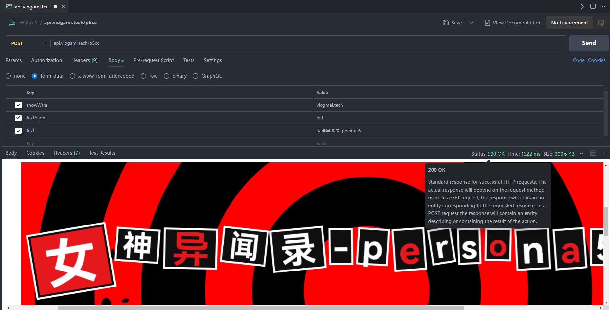

---
# general config
title: p5r预告信生成器API
slug: "p5r_p5cc"
date: 2025-02-05
description: 我制作了api版本供生产或娱乐使用。网页版有汉化版但最近网站貌似挂了，如果反响好我就自己部署一个网页版公开下。
---
预告信生成器国外作者原版：[https://skyventuree.github.io/p5cc/index.html](https://skyventuree.github.io/p5cc/index.html)

我制作了api版本供生产或娱乐使用。网页版有汉化版但最近网站貌似挂了，如果反响好我就自己部署一个网页版公开下。

本人将网页版生成器的js代码逻辑使用go语言进行了重写和部署，并开放了其api，可以直接通过get方法获取预告信的png。get方法只能最简单的绘制文本，post方法基本集成所有功能，提供了换行功能等，Text中加入换行符"\n"即可。

GitHub页面：[https://github.com/viogami/WebAPI/tree/master/p5cc](https://github.com/viogami/WebAPI/tree/master/p5cc)

> 快速开始

`http://api.viogami.tech/p5cc/:text`

eg:
[http://api.viogami.tech/p5cc/persona5](http://vioapi.zeabur.app/p5cc/persona5)

## 感谢[p5r风格字体的制作者](https://github.com/LzxHahaha)和[预告信样式的制作者](https://github.com/skyventuree)

使用了golang的[gg库](github.com/fogleman/gg)进行绘图。提供了GET方法和POST方法。GET使用动态路由直接生成，POST参数示例如下：

```yaml
text: "persona5"
fontSize: 120    # 字体大小
gutter : 10      # 字体间距
padding : 240     # 文字边距
textAlign: center  # 文字对齐方式
showLogo: true     # 是否显示Logo
logoScale: 1.0     # Logo缩放比例
logoOffset: 240     # Logo偏移量
showWtm: ""     # 水印文字，为空则不显示
```



字体暂时不可更改，默认使用了 `HarmonyOSSansSC-Bold.ttf`

## Credits

Persona 5 © ATLUS. © SEGA.

This repositories`s cord forks from [p5cc](https://github.com/skyventuree/p5cc)

Assets:

* Persona 5 Calling Card Base by [Elmind](https://www.deviantart.com/elmind).
* Persona 5 Style Text Generator by [@LzxHahaha](https://github.com/LzxHahaha). Ported and modified by [sorae42](https://github.com/sorae42).
* Persona 5 Logo and Assets by ALTUS.

All assets are all under fair use.

*Credits can also be seen on the website along with links to the original site and owners, at the bottom of the page.*
