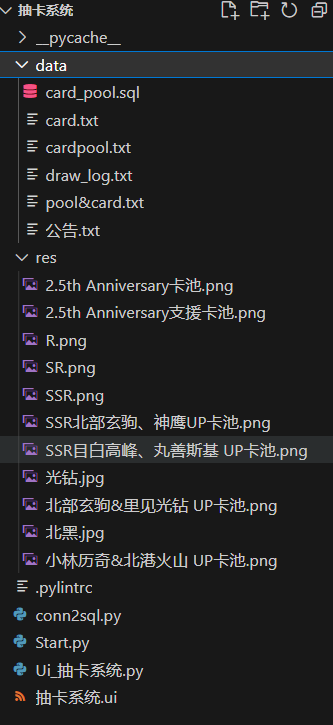
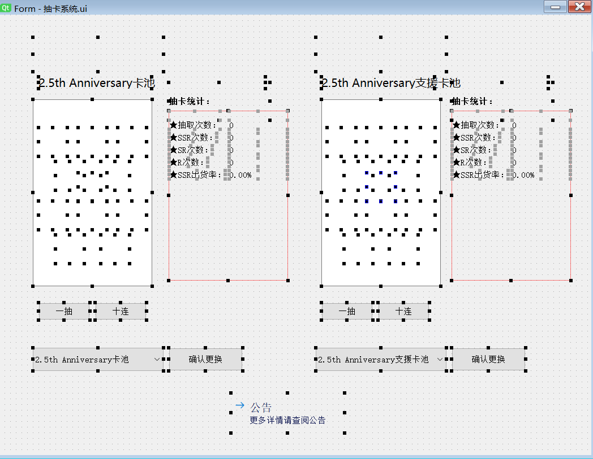
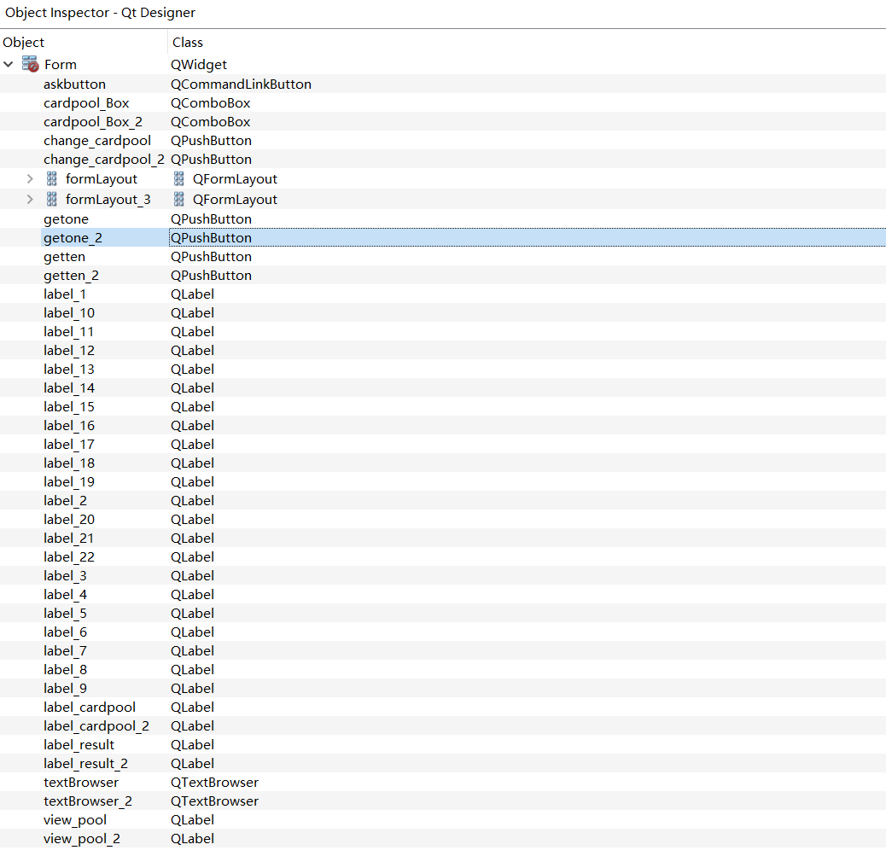
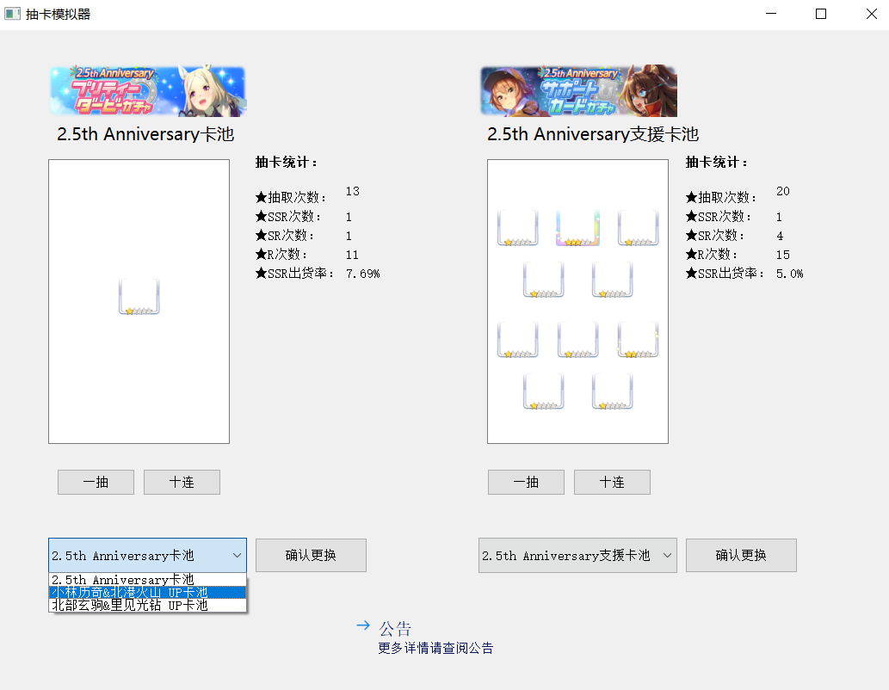

实际上Bwiki有现成的赛马娘抽卡模拟，用pyqt有参照实现更容易了：
[Bwiki赛马娘抽卡模拟器](https://wiki.biligame.com/umamusume/%E6%8A%BD%E5%8D%A1%E6%A8%A1%E6%8B%9F%E5%99%A8)

## 预览

功能实现

- [X] 单抽+十连的结果图片显示
- [X] 十连保底出现SR
- [X] 重做界面，删除无用的登陆界面
- [X] 可以抽取马娘池，也可以抽取支援卡池子
- [X] 对抽卡结果的统计
- [X] 可以自主选择卡池
- [X] 选择不同卡池出现不同的标志性图片
- [X] 显示公告
- [ ] 建立抽卡模拟器的数据库，建立表：卡池表，卡牌表，卡池&卡牌表，抽取结果表
- [ ] 连接数据库
- [ ] 显示抽卡记录的日志

项目结构：

QT界面预览：

QT控件表：

程序界面预览：


## 运行展示

由于我展示还没有创建卡牌的数据库，我只根据星级给抽卡结果进行了分类，从数据库中查找卡牌的各种信息更符合实际（但卡牌数据的构建实在过于麻烦，遂先不搞）。所以结果我做的只有外框显示就行了


## 具体实现

同样，我们需要将UI文件和启动的py文件分离。通过QTdesigner设计的界面，在vscode的qt插件中右键，选中“PYQT:Compile Form”,自动生成ui的py文件，之后新建一个启动器文件。这样的好处在于可以随时改变界面。
创建一个res文件夹存放图片文件，一个data文件夹存放数据文件。

start.py的源码：

```python
import sys
import random

#PyQt5中使用的基本控件
from PyQt5.QtWidgets import QApplication, QMainWindow,QMessageBox
from PyQt5.QtGui import QPixmap

#导入designer界面
from Ui_抽卡系统 import*

class MyMainForm(QMainWindow, Ui_Form): 
    def __init__(self, parent=None):
        super(MyMainForm, self).__init__(parent)
        self.setupUi(self)
        #提供标题
        self.setWindowTitle("抽卡模拟器")
        #添加信号和槽。  
        self.change_cardpool.clicked.connect(self.change_pool)
        self.change_cardpool_2.clicked.connect(self.change_pool_2)
        self.getone.clicked.connect(self.one)
        self.getten.clicked.connect(self.ten)
        self.getone_2.clicked.connect(self.one_2)
        self.getten_2.clicked.connect(self.ten_2)
        self.askbutton.clicked.connect(self.ask)

        # 加载并显示默认图片
        image_path = "res/2.5th Anniversary卡池.png" #默认出现的图片
        self.load_image(image_path)
        image_path = "res/2.5th Anniversary支援卡池.png" #默认出现的图片
        self.load_image_2(image_path)
```

加载图片，参数设置一个图片的路径

```python
    #马池图
    def load_image(self,image_path): 
        pixmap = QPixmap(image_path) #变为Qpixmap对象
        # 调整 QLabel 大小以适应图片
        self.view_pool.setPixmap(pixmap)
        self.view_pool.setScaledContents(True)
    #支援卡池图
    def load_image_2(self,image_path):
        pixmap_2 = QPixmap(image_path) #变为Qpixmap对象
        # 调整 QLabel 大小以适应图片
        self.view_pool_2.setPixmap(pixmap_2)
        self.view_pool_2.setScaledContents(True)  
```

定义改变卡池的函数

```python
    def change_pool(self):
        cardpool_name=self.cardpool_Box.currentText() #读取卡池信息  
        self.label_cardpool.setText(cardpool_name)
        image_path = "res/"+cardpool_name+".png" 
        self.load_image(image_path)

    def change_pool_2(self):
        cardpool_name=self.cardpool_Box_2.currentText() #读取卡池信息  
        self.label_cardpool_2.setText(cardpool_name)  
        image_path = "res/"+cardpool_name+".png" 
        self.load_image_2(image_path)  
```

池单抽和十连函数的实现

```python
    def one(self):
         #清空十连的显示结果
        self.labels = [self.label_1, self.label_2, self.label_3, self.label_4, self.label_5,
                       self.label_6, self.label_7, self.label_8, self.label_9, self.label_10] #将标签存放为标签数组
        for label in self.labels:
            label.clear()
        #获取控件数据
        getnum=int(self.value_getnum.text())
        ssrnum=int(self.value_ssrnum.text())
        srnum=int(self.value_srnum.text())
        rnum=int(self.value_rnum.text())

         # 定义不同星级卡的概率
        star_probabilities = {
            "R": 0.79,
            "SR": 0.18,
            "SSR": 0.03
        }
        # 根据概率随机抽取星级
        star = random.choices(list(star_probabilities.keys()), weights=list(star_probabilities.values()), k=1)[0]

        #显示抽卡结果
        image_path = "res/"+star+".png"  # 替换为你的图片路径
        pixmap = QPixmap(image_path) #变为Qpixmap对象
        # 调整 QLabel 大小以适应图片
        self.label_11.setPixmap(pixmap)
        self.label_11.setScaledContents(True)

        #更新统计数据
        getnum=getnum+1
        self.value_getnum.setText(str(getnum))
        if (star=="R"):
            rnum=rnum+1
            self.value_rnum.setText(str(rnum))
        elif(star=="SR"):
            srnum=srnum+1
            self.value_srnum.setText(str(srnum))
        elif(star=="SSR"):
            ssrnum=ssrnum+1
            self.value_ssrnum.setText(str(ssrnum))
  
        self.value_Pssr.setText(str(round(ssrnum*100/(getnum),2))+"%")

    def ten(self):
        #单抽结果置为空
        self.label_11.clear()
        #获取控件数据
        getnum=int(self.value_getnum.text())
        ssrnum=int(self.value_ssrnum.text())
        srnum=int(self.value_srnum.text())
        rnum=int(self.value_rnum.text())
         # 定义不同星级卡的概率
        star_probabilities = {
            "R": 0.79,
            "SR": 0.18,
            "SSR": 0.03
        }
         # 确保至少出现一张SR卡,具体实现为没有SR卡就循环重抽
        while True:
            cards_star = []
            for _ in range(10):
                rand_num = random.random()  # 生成0到1之间的随机数
                card_type = None
                # 根据随机数和概率判断抽到的卡牌类型
                if rand_num < star_probabilities['SSR']:
                    card_type = 'SSR'
                elif rand_num < star_probabilities['SSR'] + star_probabilities['SR']:
                    card_type = 'SR'
                else:
                    card_type = 'R'
    
                cards_star.append(card_type)
  
            if 'SR' in cards_star:
                break

        #将十张卡内容展现出来，并计算抽卡结果的计数
        self.labels = [self.label_1, self.label_2, self.label_3, self.label_4, self.label_5,
                       self.label_6, self.label_7, self.label_8, self.label_9, self.label_10] #将标签存放为标签数组
        for label in self.labels:
            i=self.labels.index(label)
            image_path = "res/"+str(cards_star[i])+".png"  # 替换为你的图片路径
            pixmap = QPixmap(image_path) #变为Qpixmap对象
            # 调整 QLabel 大小以适应图片
            label.setPixmap(pixmap)
            label.setScaledContents(True)
            #同时更新计数器
            if (cards_star[i]=="R"):
                rnum=rnum+1   
            elif(cards_star[i]=="SR"):
                srnum=srnum+1  
            elif(cards_star[i]=="SSR"):
                ssrnum=ssrnum+1

        #更新统计数据
        getnum=getnum+10
        self.value_getnum.setText(str(getnum))
        self.value_rnum.setText(str(rnum))
        self.value_srnum.setText(str(srnum))
        self.value_ssrnum.setText(str(ssrnum))
        self.value_Pssr.setText(str(round(ssrnum*100/(getnum),2))+"%")
```

接下来定义抽卡的函数，实现单抽和十连

```python
################# 支援卡池（上两个函数的复制，就是改变了标签名字，xxx->xxx_2）
    def one_2(self):
         #清空十连的显示结果
        self.labels = [self.label_12, self.label_13, self.label_14, self.label_15,
                       self.label_16, self.label_17, self.label_18, self.label_19, self.label_20, self.label_21] #将标签存放为标签数组
        for label in self.labels:
            label.clear()
        #获取控件数据
        getnum=int(self.value_getnum_3.text())
        ssrnum=int(self.value_ssrnum_3.text())
        srnum=int(self.value_srnum_2.text())
        rnum=int(self.value_rnum_3.text())

         # 定义不同星级卡的概率
        star_probabilities = {
            "R": 0.79,
            "SR": 0.18,
            "SSR": 0.03
        }
        # 根据概率随机抽取星级
        star = random.choices(list(star_probabilities.keys()), weights=list(star_probabilities.values()), k=1)[0]

        #显示抽卡结果
        image_path = "res/"+star+".png"  # 替换为你的图片路径
        pixmap = QPixmap(image_path) #变为Qpixmap对象
        # 调整 QLabel 大小以适应图片
        self.label_22.setPixmap(pixmap)
        self.label_22.setScaledContents(True)

        #更新统计数据
        getnum=getnum+1
        self.value_getnum_3.setText(str(getnum))
        if (star=="R"):
            rnum=rnum+1
            self.value_rnum_3.setText(str(rnum))
        elif(star=="SR"):
            srnum=srnum+1
            self.value_srnum_2.setText(str(srnum))
        elif(star=="SSR"):
            ssrnum=ssrnum+1
            self.value_ssrnum_3.setText(str(ssrnum))
  
        self.value_Pssr_3.setText(str(round(ssrnum*100/(getnum),2))+"%")   


    def ten_2(self):
        #单抽结果置为空
        self.label_22.clear()
        #获取控件数据
        getnum=int(self.value_getnum_3.text())
        ssrnum=int(self.value_ssrnum_3.text())
        srnum=int(self.value_srnum_2.text())
        rnum=int(self.value_rnum_3.text())

         # 定义不同星级卡的概率
        star_probabilities = {
            "R": 0.79,
            "SR": 0.18,
            "SSR": 0.03
        }
         # 确保至少出现一张SR卡,具体实现为没有SR卡就循环重抽
        while True:
            cards_star = []
            for _ in range(10):
                rand_num = random.random()  # 生成0到1之间的随机数
                card_type = None
                # 根据随机数和概率判断抽到的卡牌类型
                if rand_num < star_probabilities['SSR']:
                    card_type = 'SSR'
                elif rand_num < star_probabilities['SSR'] + star_probabilities['SR']:
                    card_type = 'SR'
                else:
                    card_type = 'R'
    
                cards_star.append(card_type)
  
            if 'SR' in cards_star:
                break

        #将十张卡内容展现出来，并计算抽卡结果的计数
        self.labels = [self.label_12, self.label_13, self.label_14, self.label_15,
                       self.label_16, self.label_17, self.label_18, self.label_19, self.label_20, self.label_21] #将标签存放为标签数组
        for label in self.labels:
            i=self.labels.index(label)
            image_path = "res/"+cards_star[i]+".png"  # 替换为你的图片路径
            pixmap = QPixmap(image_path) #变为Qpixmap对象
            # 调整 QLabel 大小以适应图片
            self.labels[i].setPixmap(pixmap)
            self.labels[i].setScaledContents(True)
            #同时更新计数器
            if (cards_star[i]=="R"):
                rnum=rnum+1   
            elif(cards_star[i]=="SR"):
                srnum=srnum+1  
            elif(cards_star[i]=="SSR"):
                ssrnum=ssrnum+1

        #更新统计数据
        getnum=getnum+10
        self.value_getnum_3.setText(str(getnum))
        self.value_rnum_3.setText(str(rnum))
        self.value_srnum_2.setText(str(srnum))
        self.value_ssrnum_3.setText(str(ssrnum))
        self.value_Pssr_3.setText(str(round(ssrnum*100/(getnum),2))+"%")
```

最后写一下公告，并运行

```python
     #定义公告函数
    def ask(self):   
        text=open("data/公告.txt").read()   
        QMessageBox.about(self, "公告内容", text )   

if __name__ == "__main__":
    #固定语句。sys.argv是命令行参数列表，确保程序可以双击运行
    app = QApplication(sys.argv)
    #初始化
    myWin = MyMainForm()
    #将窗口控件显示在屏幕上
    myWin.show()
    #程序运行，sys.exit方法确保程序完整退出。
    sys.exit(app.exec_())
```

公告还是从txt文件读取，其中很多参数在程序里是写死了的，比如抽卡概率，图片文件位置和名称等，适当更改。

## 源码地址

全部源码上传了 [GitHub](https://github.com/viogami/DrawCard_uma)

<script src="https://giscus.app/client.js"
        data-repo="viogami/blog"
        data-repo-id="R_kgDOORWDyA"
        data-category="Announcements"
        data-category-id="DIC_kwDOORWDyM4Conxc"
        data-mapping="pathname"
        data-strict="0"
        data-reactions-enabled="1"
        data-emit-metadata="0"
        data-input-position="top"
        data-theme="preferred_color_scheme"
        data-lang="zh-CN"
        crossorigin="anonymous"
        async>
</script>
