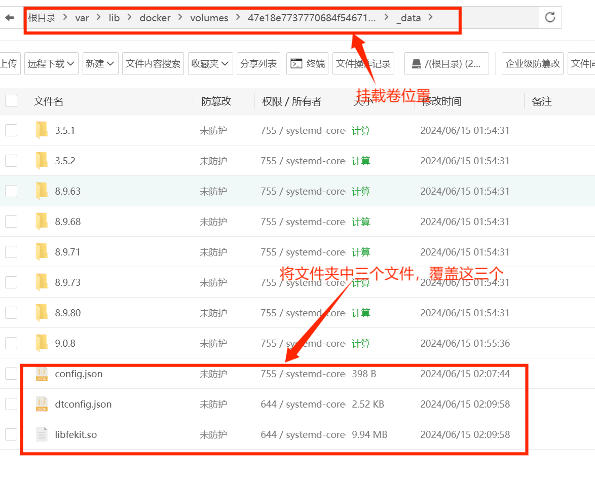
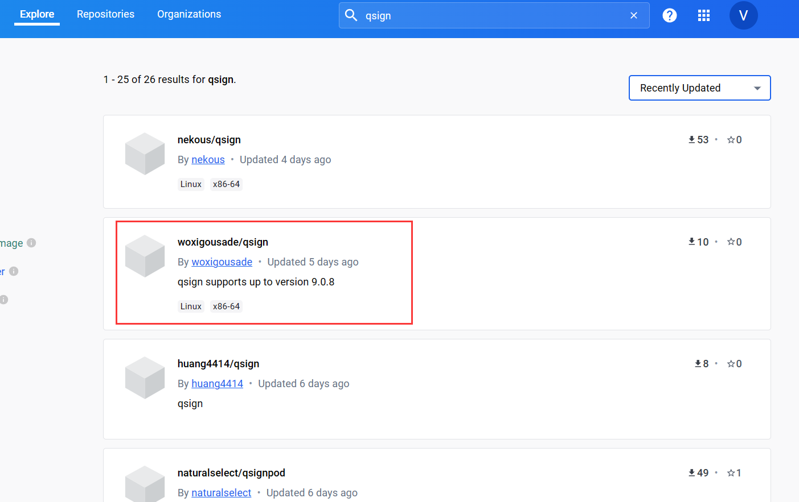

你至少需要启动三个服务

- qsign服务器
- go-cqhttp
- 你自己的机器人后端

gocq只需要启动项目即可，不需要配置域名，qsign和你的后端都需要配置域名
为了可以实现双向通信，你的后端需要实现websocket的通信。

<!--more-->

## qsign

从dokcer hub中搜索qsign，按照更新时间排序，找到一个能用的，运行 `pull`命令。
注意，下载次数最高的镜像无法拉取的，删了跑路了，时间排序到一个有新版本的镜像，低版本的qsign可能会无法登陆。

> 如果是通过宝塔部署，在镜像中通过镜像搜索，找到qsign相关镜像无法拉取，都是该镜像跑路了，仓库中不存在，换一个镜像重新拉取即可。

**建议将其部署在国外服务器上。**
通过请求qsign服务器，gocq会得到一个token，这个token需要一段时间后刷新，所以需要qsign服务器一直保持活跃。
可以使用docker拉取一个镜像，快速部署,部署后配置域名，get该地址可以获得一个json信息为配置成功。

注意：最好部署新的版本，如9.0.8，但是docker镜像很多都是镜像只支持老版本，要用新版本需要手动导入新的版本文件，到挂载卷里

### **如果你熟悉docker，会最基本的卷挂载，端口映射可以使用：**

[https://hub.docker.com/r/bennettwu/qsign-server](https://hub.docker.com/r/bennettwu/qsign-server)
这个镜像的发布者说明也很清楚了，可以不用命令行部署，直接宝塔拉取镜像，创建容器，然后进入容器挂载卷的文件夹内，把9.0.8版本的文件放入，注意，不是文件夹，是覆盖'/app/txlib'内的



这个镜像较为完整，功能也正常，到docker挂载卷的文件中放入9.0.8版本的qsing文件，同时修改config文件。
**config中一点要设置自动注册实例为true，并且设置端口，config中设置的端口将直接影响容器内端口映射是否能正确**

最后这个镜像可以通过：`'http://your-site:1145/sign'`来访问该qsign服务。
其中，1145是我手动映射到容器的外部端口，/sign是该镜像指明的url访问。

### **如果不熟悉docker，可以使用如下镜像一键部署9.0.8版本**

[https://hub.docker.com/r/woxigousade/qsign](https://hub.docker.com/r/woxigousade/qsign)



`注意，该镜像在被请求一次后，容器可能会停止，需要自己设置自动重启。同时实例自动注册可能出现问题，原因未知，因为本人熟悉点docker，我已经换上面的那个了`。

部署可以直接参考docker镜像发布者的说明。
通过命令行,镜像run个容器：

```docker
docker run -d -p 9000:8080 --restart=always --name=qsign -e VERSION=9.0.8 woxigousade/qsign:latest
```

命令解释：

- 服务器9000端口映射容器内8080端口
- 重启策略设置为"always"
- 创建的容器名为'qsing'
- 使用版本9.0.8

**完成了docker部署，并启动容器之后给该docker部署的镜像设置公网可以访问的域名或者暴露该端口(如9000)直接用端口号访问即可，直接get会有json信息返回，鉴定为部署成功**，返回code 0和1都是正常的，主要要看gocq的登录返回信息。

```json
{
    "code": 1,
    "msg": "Parameter 'uin' is missing.",
    "data": "failed"
}
```

## gocq

- 拉取gocq项目文件，直接启动一次项目，生成必要的文件
- 修改协议
- 填写配置文件
- 打包部署到服务器

### 第一步

无要点，下载项目的release版本，或者安装go直接拉项目本地跑

### 第二步

建议使用手表协议，device.json改protocol的值为2
将qsign中的config.json文件重命名为6.json，放在项目的 `data/versions`文件中

### 第三步

注意 `config.yml`文件的填写
只有三个地方是必须要修改的：**qq号和密码、qsign服务器地址、服务后端地址(http or ws)**

```yaml
# go-cqhttp 默认配置文件

account: # 账号相关
  uin: your-qq# QQ账号
  password: '' # 密码为空时使用扫码登录
  encrypt: false  # 是否开启密码加密
  status: 0      # 在线状态 请参考 https://docs.go-cqhttp.org/guide/config.html#在线状态
  relogin: # 重连设置
    delay: 3   # 首次重连延迟, 单位秒
    interval: 3   # 重连间隔
    max-times: 0  # 最大重连次数, 0为无限制

  # 是否使用服务器下发的新地址进行重连
  # 注意, 此设置可能导致在海外服务器上连接情况更差
  use-sso-address: true
  # 是否允许发送临时会话消息
  allow-temp-session: false

  # 数据包的签名服务器列表，第一个作为主签名服务器，后续作为备用
  # 兼容 https://github.com/fuqiuluo/unidbg-fetch-qsign
  # 如果遇到 登录 45 错误, 或者发送信息风控的话需要填入一个或多个服务器
  # 不建议设置过多，设置主备各一个即可，超过 5 个只会取前五个
  # 示例:
  # sign-servers: 
  #   - url: 'http://127.0.0.1:8080' # 本地签名服务器
  #     key: "114514"  # 相应 key
  #     authorization: "-"   # authorization 内容, 依服务端设置
  #   - url: 'https://signserver.example.com' # 线上签名服务器
  #     key: "114514"  
  #     authorization: "-"   
  #   ...
  # 
  # 服务器可使用docker在本地搭建或者使用他人开放的服务
  sign-servers: 
    - url: 'your-qsign-site'  # 主签名服务器地址， 必填
      key: '114514'  # 签名服务器所需要的apikey, 如果签名服务器的版本在1.1.0及以下则此项无效
      authorization: '-'   # authorization 内容, 依服务端设置，如 'Bearer xxxx'


  # 判断签名服务不可用（需要切换）的额外规则
  # 0: 不设置 （此时仅在请求无法返回结果时判定为不可用）
  # 1: 在获取到的 sign 为空 （若选此建议关闭 auto-register，一般为实例未注册但是请求签名的情况）
  # 2: 在获取到的 sign 或 token 为空（若选此建议关闭 auto-refresh-token ）
  rule-change-sign-server: 1

  # 连续寻找可用签名服务器最大尝试次数
  # 为 0 时会在连续 3 次没有找到可用签名服务器后保持使用主签名服务器，不再尝试进行切换备用
  # 否则会在达到指定次数后 **退出** 主程序
  max-check-count: 0
  # 签名服务请求超时时间(s)
  sign-server-timeout: 60
  # 如果签名服务器的版本在1.1.0及以下, 请将下面的参数改成true
  # 建议使用 1.1.6 以上版本，低版本普遍半个月冻结一次
  is-below-110: false
  # 在实例可能丢失（获取到的签名为空）时是否尝试重新注册
  # 为 true 时，在签名服务不可用时可能每次发消息都会尝试重新注册并签名。
  # 为 false 时，将不会自动注册实例，在签名服务器重启或实例被销毁后需要重启 go-cqhttp 以获取实例
  # 否则后续消息将不会正常签名。关闭此项后可以考虑开启签名服务器端 auto_register 避免需要重启
  # 由于实现问题，当前建议关闭此项，推荐开启签名服务器的自动注册实例
  auto-register: false
  # 是否在 token 过期后立即自动刷新签名 token（在需要签名时才会检测到，主要防止 token 意外丢失）
  # 独立于定时刷新
  auto-refresh-token: false
  # 定时刷新 token 间隔时间，单位为分钟, 建议 30~40 分钟, 不可超过 60 分钟
  # 目前丢失token也不会有太大影响，可设置为 0 以关闭，推荐开启
  refresh-interval: 40

heartbeat:
  # 心跳频率, 单位秒
  # -1 为关闭心跳
  interval: 5

message:
  # 上报数据类型
  # 可选: string,array
  post-format: string
  # 是否忽略无效的CQ码, 如果为假将原样发送
  ignore-invalid-cqcode: false
  # 是否强制分片发送消息
  # 分片发送将会带来更快的速度
  # 但是兼容性会有些问题
  force-fragment: false
  # 是否将url分片发送
  fix-url: false
  # 下载图片等请求网络代理
  proxy-rewrite: ''
  # 是否上报自身消息
  report-self-message: false
  # 移除服务端的Reply附带的At
  remove-reply-at: false
  # 为Reply附加更多信息
  extra-reply-data: false
  # 跳过 Mime 扫描, 忽略错误数据
  skip-mime-scan: false
  # 是否自动转换 WebP 图片
  convert-webp-image: false
  # download 超时时间(s)
  http-timeout: 15

output:
  # 日志等级 trace,debug,info,warn,error
  log-level: warn
  # 日志时效 单位天. 超过这个时间之前的日志将会被自动删除. 设置为 0 表示永久保留.
  log-aging: 15
  # 是否在每次启动时强制创建全新的文件储存日志. 为 false 的情况下将会在上次启动时创建的日志文件续写
  log-force-new: true
  # 是否启用日志颜色
  log-colorful: true
  # 是否启用 DEBUG
  debug: false # 开启调试模式

# 默认中间件锚点
default-middlewares: &default
  # 访问密钥, 强烈推荐在公网的服务器设置
  access-token: ''
  # 事件过滤器文件目录
  filter: ''
  # API限速设置
  # 该设置为全局生效
  # 原 cqhttp 虽然启用了 rate_limit 后缀, 但是基本没插件适配
  # 目前该限速设置为令牌桶算法, 请参考:
  # https://baike.baidu.com/item/%E4%BB%A4%E7%89%8C%E6%A1%B6%E7%AE%97%E6%B3%95/6597000?fr=aladdin
  rate-limit:
    enabled: false # 是否启用限速
    frequency: 1  # 令牌回复频率, 单位秒
    bucket: 1     # 令牌桶大小

database: # 数据库相关设置
  leveldb:
    # 是否启用内置leveldb数据库
    # 启用将会增加10-20MB的内存占用和一定的磁盘空间
    # 关闭将无法使用 撤回 回复 get_msg 等上下文相关功能
    enable: true
  sqlite3:
    # 是否启用内置sqlite3数据库
    # 启用将会增加一定的内存占用和一定的磁盘空间
    # 关闭将无法使用 撤回 回复 get_msg 等上下文相关功能
    enable: false
    cachettl: 3600000000000 # 1h

# 连接服务列表
servers:
  # 添加方式，同一连接方式可添加多个，具体配置说明请查看文档
  #- http: # http 通信
  #- ws:   # 正向 Websocket
  #- ws-reverse: # 反向 Websocket
  #- pprof: #性能分析服务器
  # 反向WS设置
  - ws-reverse:
      # 反向WS Universal 地址
      # 注意 设置了此项地址后下面两项将会被忽略
      universal: wss://your-site/ws
      # 反向WS API 地址
      api: ws://your_websocket_api.server
      # 反向WS Event 地址
      event: ws://your_websocket_event.server
      # 重连间隔 单位毫秒
      reconnect-interval: 3000
      middlewares:
        <<: *default # 引用默认中间件
```

### 第四步

不输入密码，使用扫码登陆。注意先在本地登陆一次，登陆成功后把 `data`文件夹和 `session.token`文件上传服务器即可，在服务器端登陆可能会显示登陆风险，要求同一网络。

## 后端建设

我用go写的后端
创建ws连接的路由
部署你的后端到国外服务器上/Paas上,将pass提供的地址作为ws地址。
