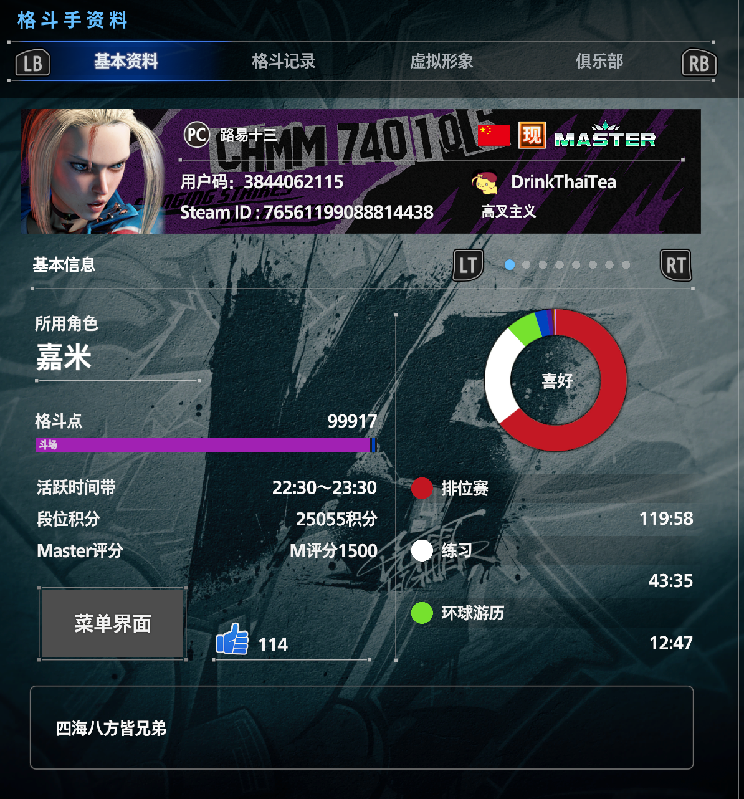

## 迟来的笔

想写点什么，但很懒惰，其实在去年11月左右就老是感觉得记录一下了，奈何阻力重重，键盘按下千斤重呢。
也许也因为我怕写不出什么内容。现在正有精神，连本带息全都print下来吧。

## 透传2025年

此乃转折，正式上班的第一年。上半年在南京，庆幸离开了那里，走的时候在公司没什么不愉快，留下的回忆却是下作的。一口气飞去广州，想起来也是痛快的举动。很好运，在这边有不错的发展，也持续到现在。

独身，这是这一年最好的总结，这一年可以说，完全是我自己摸索的，没有任何人依靠。

我初中的时候不知道从哪个三流杂志看到一句话：苏世独立，横而不流。感觉超帅，当座右铭一样供着。实际上这么多年下来，我早就理解到我是个想被关注，想交很多朋友的人，所谓搞“独立”，搞哗众取宠，搞点装唐，都是逻辑可循的。已经成惯性打法了，就算知道，也只是回忆起来的时候知道了。

不过还好，组成我的社会关系总和还是满意的，除了缺少一些粉色的花。约从9月开始，我才算真正的“苏世独立”，前面多少带点割舍不了的东西，到这个时候，已经把盼望抛掷脑后了，用最鼠最寸的目光面对生活，解决自己的衣食住行，吃喝玩乐。到了12月，逐步安定了，也从深巷里小屋跑路了，物质生活的漏洞被逐一补齐，对外不散发能量，要开始对内了。也在这个时候，我初步领略到了我自己的一个巨大优势，那就是适应力，不是无能妥协的那种适应，而是借力打力的适应。

我最不耐烦的就是模式化，最表象的就是我无法坚持重复，或者停止或者加点花样，在很短的时间内我就会追寻变化，找到适合我自己的模式。我最擅长的就是顺着车辙起步，而后自由发散。比方我很小的时候我就能通过复述重组长辈的问题完成对问题的回答，其实啥也没说，还夸我聪明。

适应力的发现使我重新认识了自我，甚至水土不服都没有，皮炎也就花了一个月。我之前一直希望我能创造，而我的适应力应该会使得我更擅长改良。我确实有不少好点子，比如看无职，人神托梦的剧情一出现，我就自动构思了一个剧情：
> 玩家通过扮演主角完成一周目的剧情，但必须是一个be。此后玩家将作为二周目的上帝视角去影响一周目行为下的自身行为，同时回收一周目埋下的伏笔，直至达成he。
但是我无法开始，我的创造始终是一直改良，没有无花之果，要触发行动，我最缺就是临界的一推，关键的迈出。

这个结论的推演来自11月中，我去参加了一个游戏沙龙，请了天假，见到了元气骑士制作人等等，很是失望，嘉宾的发言倒是没什么问题，符合身份也符合实力。失望的是游戏展示环节，没有一个游戏可以让我眼前一亮，只有三个开发的动作游戏，一个完全用的琪亚娜模型，过于残缺的崩坏3，一个用了较为优秀的动画和演出，但是也就是对当前二游动作的模仿，毫无亮点。还有一个是已经上线的游戏，飞儿，仿的嗜血印，有点新意还是不足。

我全是不满，可惜却没有交流的可能性，因为他们在模仿的路上走了很远，而我原地踏步了很久，没有外界推力驱动我或者指导我下一步，我一遍又一遍的打磨想法但动不了工。我给各种设定的命名，联机服务端的框架磨了又磨，都没有实质的进展。

好在我喜欢完整，好比再烂的动漫我倍速也要看完。我计划的事即使逾期了我也不会关闭，我会在合适的时候重新捡起来。理论永远是超前的，实践需要各式各样的基础。有这个前提，我可以无限存储我的计划，因为我知道我会在更有精神的时候重启。这篇文可是延了好多个月，但是我一定会完成。

## 买了什么

智能路障关于消费主义的一期视频我深是赞同，现代社会人需要通过消费来强化存在，一直不花钱会产生脱离社会的错觉。那么去年一年买了什么呢？除了地球online的必要花费，男人花钱无非就是上半身和下半身。上半身让自己更像一个人，而对我来说主要就是电子产品，包括今年年初配的主机。穿搭是即刻要研究的。其他就是买游戏，买设备，为爱好花米。下半身无他，可支配内怡情就好。

消费观会间接体现价值理念，为爱好花钱会是一个恒久的话题。怎么判断是否需要，是个深奥的问题。一根全能c线就让我纠结3天，因为新买的显示器支持一屏多显(PBP,PIP)，但需要全能c线连笔记本。而如果我接下来买mac又会自带c线。中转方案，如多用一个鼠标，用hdmi线连接切换等，都不理想。最后还是新买一个。

这样的选择判断，无时无刻发生。我常开玩笑的感觉，花钱是我最不会逾期的计划，能硬上都上了，只要判断能拿下。我的价值理念就是物尽其用，又专其用。该干嘛的就干那个的，不要领域穿透。所以我不喜欢瑞士军刀，对13合1的超能液体也没什么感觉。

## 看了什么

25年最推荐的就是看了芙莉莲，公路番的制作很精良，叙事节奏太像紫罗兰了（有一说一，紫罗兰也是龙王番，机械臂最猛的一集），平淡却力道遒劲。不会给你硬上bgm，榨你点眼泪，就是一点点波动心情，意识到的时候已经心神荡漾了。

拳愿阿修罗是其次的力荐，今井小宇宙，疑似嘉米转世，打不死我的就一直打不死我，是真龙。为数不多能让我热血沸腾的了，而且剧情不俗套，重新定义什么叫牛逼，什么叫龙就是龙。主角路边一条，再成长也是路边，哈哈。

章鱼辟勉强推荐吧，邪典一个。寄生兽很棒，但是传达的理念居然是环保，不可思议。碧蓝之海，想详细说说，但感觉还是算了，青春番就它和春物要被我列入禁番了。怀念过去是因为现在过的不好，而这两番不一样，怀念过去就是因为怀念过去。

重新拾起日剧，刷了遍半泽直树和非自然死亡，前者没啥好说的，爽文，下班看最爽。后者是真牛逼，lemon原汤化原食真是眼睛尿尿了，校园霸凌一集纯封神之战，一刀复仇杀人犯也是反套路。主线反而没有太惊艳，属于合理发展

开了好几个月b站会员刷完了风骚律师，拍的很艺术，越到后面越好玩，特别是有加罗的部分，毛骨悚然不是闹了玩的。也是恰巧看这个的时候火了斩杀线这个梗，还挺贴切的。

现在刚推完冰海战记，感慨万千，巨人和冰海战记真是动漫里的战争与和平吧，叙事无敌。看完第二季再回到第一季，发现伏笔比比皆是，不得不佩服巧思。逃跑去vinland，真是不可思议。我曾开玩笑的说，我看过的小说，动漫，游戏，足够我过几百次人生了。只要不停的思考，思考出结果，无数次的模拟该理论指导实践了。

好比博物馆也不是用来看的，90%的内容都毫无视觉刺激，还是大脑的补充提高了体验。老古董，小静物，没啥好看的。故事本来就是用来想的，看，毫无意义，想，意义非凡。

## 玩了什么

### 你怎么知道我街霸大师了？

