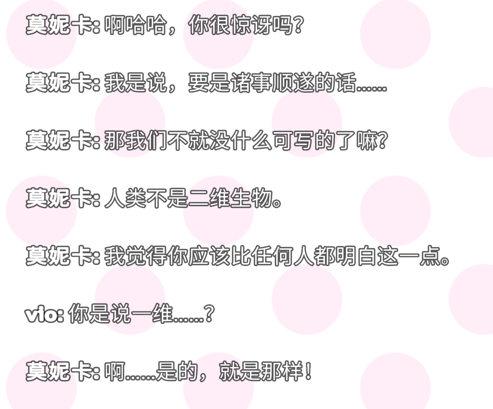

---
# general config
title: DDLC实况吐槽
slug: ddlc
subtitle: 
date: 2024-07-21
authors:
  - viogami: author.png

# # card specific config
# summary: A summary of the blog post
# cardimage: photo1_card.jpeg

# # post specific config
# featureimage: photo1.jpeg
# caption: Some image caption
# toc: true
---

心跳文学社久闻大名，梗图也很多，但是原来是17年的游戏还是老美的，也没配音，一直没启动过。

<!--more-->

今天看到库存就想打开试试。21年做了plus版本，虽然还没配音，但是剧情我也想吃一次原味的，做个游玩时候的心情记录。

**经典青梅开局，什么gal文化输出到了老美啊，而且文学部他是真讨论文学啊，比古典部强。写作技巧也是实在话。游戏方式是选词加好感大概。前面都是正常的，就是女角色疑似有点没见过男人了。先塑造青梅然后毁掉是吧，我是一心一意战士，绝不重蹈诚哥覆辙。**

- ### 夏树的伏笔？感觉这角色事太多

- ### 前面莫妮卡暗示挺多，伏笔

- ### 不给我一心一意战士操作空间非要我选是吧，绷不住了，还不给选莫妮卡

- ### 推完了，包括支线。总之还是挺短的，果然在有心理预期的情况下玩游戏，体验肯定是达不到预期的。喜欢纱世里，莫妮卡正常点吧，纯对我好我怎么不接受呢

- ### 支线纯糖(褒义)，后面夏树和尤里剧情纯铝铜

- ### dlc支线的核心我觉得可以概括为：``发现自己值得被爱 ``

其实玩了支线倒挺共情夏树的，特指最后一部分。傲娇并不是极端化出来的属性，而是现实普遍存在的心理的夸张。总而言之
反正角色各自有各自的心理问题，这不是什么戏剧化的内容，至少我觉得一定程度上解释我为什么无脑选纱世里。

