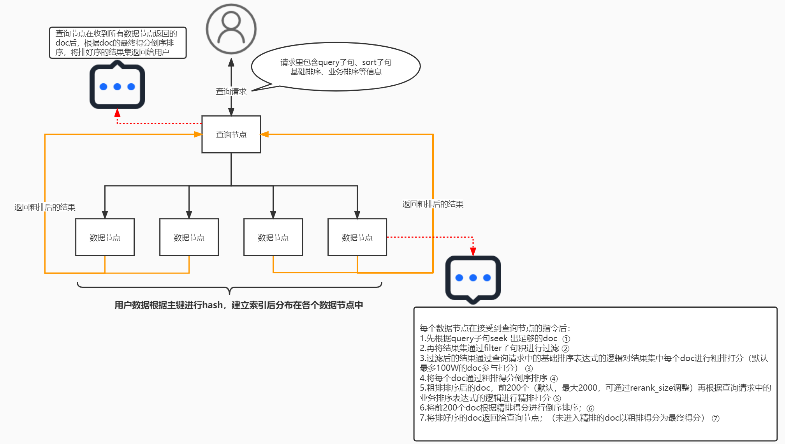
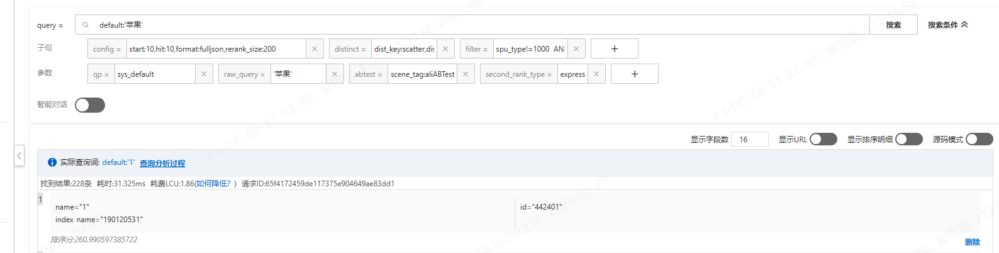

阿里云的opensearch主要是做搜索使用，会通过用户的行为操作，加入一些权重设置、AI训练模型，来做人气模型和类目预测。opensearch目前产品单价较高，每月费用近2万（行业算法版）。仅需要图像搜索可用向量检索版，费用约700.

<!--more-->

本文来源于个人工作语雀文档，个人二次摘要提取。

## 排序说明

阿里云处搜索测试可见排序公式，排序计算结果示例：
FirstRank:
expression[static_bm25()], result[0.496452].
SecondRank:
expression[text_relevance(name)], result[0.225903].
FirstRank表示基础排序得分，10000+基础排序表达式计算的结果，总分最大为20000，超过20000结果仍为20000
SecondRank表示业务排序得分，10000+业务排序表达式计算的结果，总分无上限。
同时配置了基础排序和业务排序，那么进入业务排序的文档最终得分为（10000+业务排序表达式计算的结果），其余文档最终得分为（10000+基础排序表达式计算的结果，总分最大为20000，超过20000结果仍为20000）。
值得记录的点：
● 排序计算的详细过程可在fulljson的输出格式，通过tracerInfo字段查看，但提供的接口不会返回该字段
● 目前返回的只有id和name，但通过向fetch_fields参数传值可拿到更多的字段
● 如何归一化？normalize函数如果不设置最大最小值，会用反正切函数做归一化，效果不太理想，ops内置函数的返回基本值域都是[0,1]，所以最好做法是计算公式理论最大值，填入max和min参数，可以线性归一。
搜索排序操作和语句配置详细文档：[阿里云opensearch行业算法版 排序配置详细文档](https://www.alibabacloud.com/help/zh/open-search/industry-algorithm-edition/opensearch-sorting-practice-industry-algorithm-version-document?spm=a2c63.p38356.help-menu-29102.d_3_0_1.752a7d51mRzCeg)

业务干预在阿里云业务排序中实现，(原得分*shop_weight+topping_score)*business_sort_weight,
黄色部分为业务干预分，乘上业务权重后为重排得分，重排得分即为最终得分。
针对重排权重，有五个重排维度，但opensearch只计算后三个，连续商家限制通过opensearch的打散机制实现，如有连续5个相同的商家，则后续结果后延。

## 下拉提示

对于候选query的生成规则，我们针对过去N（默认7天）的历史query，结合该query的词权重，召回结果数，历史搜索次数，近一天查询是否有结果等条件，选出一些热门历史查询词，作为下拉提示的候选词。系统支持两种规则生成候选query：抽取生成和原值保留。

## 多路召回

多路搜索目前只有文本和向量两路，各自通过基础和业务排序计算搜索结果，然后通过一次归并排序综合结果。
归并排序的意义：决定文本路的分数(如0.8) 和向量路的分数(如0.6)，谁更优？
● 阿里云多路召回功能不支持aggregate、distinct子句；
● 多路搜索配置中，文本搜索和向量搜索是必选项，并且二者的召回结果占比和需为100%；
● 多路搜索配置中，文本搜索和向量搜索的基础排序从排序配置-基础排序中选择，业务排序从排序配置-业务排序中选择；
● 综合排序配置中，归并排序从业务排式中选择，必选，也可以选择“无”，默认选择“无”，各自占一半，排序文档数量为必填，最多为5000，需填写大于0的值；
多路召回必设置三个参数，原始查询词(raw_query)，多路搜索查询策略(search_strategy)，查询分析规则(qp)

## 如何使用

1.需要购买阿里云opensearch实例机器，所有操作均可在阿里云侧后台实现，最终只需要调用一个提供的即可即可返回搜索内容。
2.将本地数据同步到opensearch机器中，这一步在阿里云后台实现
3.阅读官方文档，定义结构，使用其sdk调用api接口

搜索中的查询子句，均是要拼接到query参数中，于搜索测试中不同

